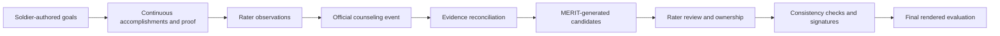

# 01 - MERIT Product Overview

> **Audience:** Program leaders, prospective customers, evaluators, and new team members.  
> **Purpose:** Explain the problem MERIT solves, the operating model, the principal users, and the expected value in one document.

## The problem

Army evaluations are high-stakes, heavily regulated, and too often reconstructed from memory near the deadline. That creates predictable costs:

| Current problem | Operational consequence |
| --- | --- |
| Support forms completed late or retroactively | Accomplishments are forgotten and narratives become generic. |
| Evidence lives in email, local files, or memory | Claims are difficult to verify and do not survive leader turnover. |
| Raters start from a blank page | Experienced leaders spend hours wordsmithing instead of leading. |
| Counseling, signatures, and submission rules are tracked manually | Missed suspenses and HRC returns create rework. |
| Rating relationships change over time | Historical authority can become ambiguous without immutable assignment records. |
| Drafting quality varies by rater experience | Soldiers receive inconsistent records for comparable performance. |

MERIT starts from a different premise:

> **The evaluation should be the byproduct of a documented rating period, not a deadline-night reconstruction.**

## What MERIT is

**MERIT (Mission Evaluation Record & Insight Tool)** is a cloud-first performance-management and Army evaluation workflow. It connects four activities that are usually fragmented:

1. **Authoritative context** - read-only personnel, unit, duty, and rating-assignment information.
2. **Continuous performance capture** - Soldier accomplishments, proof artifacts, goals, and rater observations collected throughout the period.
3. **MERIT-assisted drafting** - evidence-grounded, regulation-aware candidate bullets that the assigned rater must review, edit, accept, or reject.
4. **Regulated completion** - consistency checks, ordered signatures, final-form review, export, submission state, and audit history.

MERIT does not replace leader judgment, DA Form 4856 counseling, HRC policy, or an official Army system of record. It provides a controlled workspace around those responsibilities.

## The operating loop

### 1. Goals establish intent

The rated Soldier authors goals by leadership dimension. The assigned rater approves them or requests revision. Goals provide context; they are not proof that performance occurred.

### 2. Accomplishments and artifacts establish evidence

The Soldier records factual accomplishments and may attach certificates, score sheets, photos, or documents. Artifacts receive a factual MERIT caption once and are reused as drafting context.

### 3. Rater observations preserve leader perspective

Only the assigned rater can create, edit, delete, or release a `PerformanceObservation`. An observation remains private to the rater until it is discussed and released through counseling.

### 4. Counseling reconciles the record

The counseling-preparation workspace composes goals, evidence, and observations for one real official counseling event. MERIT stores an outcome summary and optional reference to the completed official record; it does not create a second DA Form 4856.

### 5. MERIT turns evidence into reviewable candidates

The rater selects exact accomplishments and observations. MERIT produces ranked candidates grounded in those sources and the relevant doctrine. A linked goal may explain intent, but cannot support a factual claim by itself.

### 6. The rating official owns the final record

Every MERIT suggestion must be accepted, edited, or rejected. Accepted content retains permanent provenance back to the exact source snapshot. No suggestion becomes signed evaluation content without a human decision.

## Users and authority

| User | Primary responsibility | Important boundary |
| --- | --- | --- |
| Rated Soldier | Authors goals, records accomplishments and proof, acknowledges the final evaluation | Cannot author rater narrative or see private observations. |
| Rater | Approves goals, records observations, authors Part IV, owns final bullets | Authority exists only for assigned rating relationships. |
| Senior Rater | Assesses potential and completes succession planning | Cannot replace the rater's narrative. |
| Supplementary Reviewer | Performs the required additional review and signature | Cannot generate bullets, confirm evidence, or author ratings. |
| Commander | Views formation-level status and rating relationships | Does not gain access to evaluation content solely from command visibility. |
| Administrator | Manages EES access, identity exceptions, and authorized setup | Cannot impersonate a rating official or sign for another person. |
| Access assistant | Performs explicitly granted clerical/evidence tasks under their own identity | Never receives rating, signature, acknowledgment, or submission authority. |

A user may hold multiple roles. The server resolves authority per resource through the published assignment and, for created evaluations, the immutable evaluation snapshot.

## The two principal workspaces

### Support Form

A living rating-period record containing:

- Soldier-authored goals and progress assessments
- Accomplishments organized by the six leadership dimensions
- Evidence artifacts and discrepancy flags
- Rater confirmation or clarification of accomplishments
- Rater-owned performance observations
- Counseling preparation and official-record references
- A chronological performance timeline

### Evaluation

The NCOER/OER workspace containing:

- Grade-appropriate form selection and rating scale
- Part III duty description
- Six Part IV leadership dimensions
- Manual and MERIT-assisted drafting
- Unsupported-fact and prohibited-language checks
- Rater and senior-rater assessments
- Ordered signatures and stale-signature detection
- Final-form confirmation and PDF export
- Returned-evaluation reason and correction flow

## The MERIT assistance principle

> **MERIT assists and suggests. The rating official decides and owns.**

Four controls enforce that principle:

1. **Evidence in** - drafting starts from selected evidence or an explicit rater description.
2. **No invented facts** - MERIT may reorganize and strengthen writing, but may not create numbers, dates, awards, schools, or outcomes absent from the source.
3. **Mandatory review** - a section cannot complete while MERIT suggestions remain undecided.
4. **Permanent provenance** - final MERIT-touched content retains its source type, source IDs, immutable source snapshot, and human review decision.

Internal implementation values such as `AIBulletSuggestion`, `AI_MODIFIED`, and `AI_UNMODIFIED` remain technical database/API contracts. The product presents these records as MERIT suggestions and MERIT provenance.

## Expected value

MERIT changes evaluation work from blank-page authoring to evidence review.

| Value area | Expected effect |
| --- | --- |
| Leader time | Less time reconstructing performance and rewriting weak bullets. |
| Record quality | More specific, supportable narratives tied to the rating period. |
| Fairness | Less dependence on a rater's individual writing experience. |
| Compliance | Earlier visibility into missing counseling, incomplete sections, signatures, and unsupported claims. |
| Auditability | A defensible record of source evidence, MERIT assistance, human decisions, signatures, and export. |
| Institutional memory | Performance evidence survives PCS, turnover, and rating-chain changes. |

A pilot should measure authoring time, support-form timeliness, counseling compliance, HRC return rate, and user confidence before and after adoption. Any ROI estimate before that measurement is illustrative, not an audited financial claim.

## Product boundaries

MERIT currently does **not** claim:

- Production accreditation or an Authority to Operate
- Live IPPS-A, iPERMS, Microsoft Graph, CAC/PKI, HRC, ATIS, or DTMS integration
- Automatic verification against iPERMS
- Autonomous ratings or autonomous final narrative
- A replacement for official counseling records
- An authoritative HRC rater profile or rater tendency feed
- Full OER authoring parity with the NCOER builder

See [03 - Technical Architecture](./03-technical-architecture.md) for real-vs-stubbed integrations, [05 - Security and Compliance](./05-security-and-compliance.md) for deployment posture, and [06 - Roadmap and Status](./06-roadmap-and-status.md) for current delivery state.
