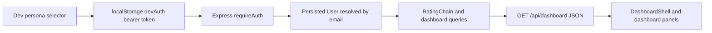

# EES 2.0 Data Flow and API Contract

## Purpose

This document identifies what the database stores, which backend routes read or change it, and how the dashboard receives the resulting data. It reflects the code in `prisma/schema.prisma`, `src/routes`, and `ees2-frontend/src` as of 2026-07-17.

### Authority boundary

This is the **current application/API contract**, not a field-by-field database catalog. For exact tables, columns, enum values, foreign keys, indexes, and the current migration-state caveat, use [14 - Supabase PostgreSQL Database Schema Reference](./14-database-schema-reference.md). For current remediation posture and the status of legacy/quarantined records, use [10 - Regulatory Remediation Status](./10-regulatory-remediation-status.md). The pre-remediation findings in [09 - Permission and Assignment Audit](./09-permission-and-assignment-audit.md) are historical evidence only.

## Identity and Session Flow

The development login selector sends `Bearer dev:<email>:testpass`. `requireAuth` maps that token to a development profile and then resolves the matching persisted `User` by email. The persisted `User.id` must be used for all chain queries because `RatingChain` foreign keys point to that database ID.

The dashboard endpoint updates `User.lastLoginAt` after it returns its response. On the next dashboard load, it compares that timestamp to user-scoped notifications, evaluation updates, and support-form entry updates. OpenAI receives only the resulting event facts and produces a one-sentence recap; a deterministic fallback is used when OpenAI is unavailable.

## Core Database Models

| Model | Ownership and key fields | What it represents |
| --- | --- | --- |
| `User` | `id`, `email`, `rank`, `roles`, `unitId`, `lastLoginAt` | A person who can be a rated soldier, rater, senior rater, reviewer, commander, or administrator. |
| `Unit` | `id`, `uic`, `parentId` | Unit hierarchy used by commander formation views. |
| `RatingSchemeAssignment` | officials, form category, effective dates, status, review requirement | The compliance-authoritative relationship for new records. It is validated, approved, published, and replaced prospectively. |
| `RatingChain` | `ratedSoldierId`, `raterId`, `seniorRaterId`, optional `reviewerId`, `isActive` | Legacy assignment relationship retained while older records and consumers migrate. |
| `SupportForm` | `soldierId`, optional chain/assignment link, lifecycle status, disposition, consumption metadata | The rated soldier's evidence record for one period. New forms are assignment-backed; legacy forms remain readable only while migration completes. |
| `SupportFormEntry` | `supportFormId`, author metadata, lock metadata, section, entry type, raw text | Soldier accomplishments/objectives used as evidence and AI context, with attributable creation and confirmation lock state. |
| `Evaluation` | legacy chain, optional support form, status, disposition, optional snapshot | The NCOER/OER. Assignment-backed creation atomically consumes the form and creates a snapshot. |
| `EvaluationRatingSnapshot` | evaluation, assignment, officials, ranks, categories, form category | Immutable source of authority and regulatory facts for a new evaluation. |
| `EvalSection` | `evaluationId`, `section`, ratings, bullets | Rater/senior-rater evaluation content. |
| `EvalMilestone` | `evaluationId`, `type`, `status`, `dueDate` | Counseling and evaluation suspense dates. |
| `Notification` | `userId`, optional `evaluationId`, `category` | A user-specific event message. |
| `IdentitySourceRecord` | user, source system, authoritative identifiers, sync status/timestamps | Read-only source projection and synchronization state; it does not replace the referenced `User`. |
| `IdentityException` | optional user, type, status, severity, resolution | A reconciliable identity/synchronization exception, including unmatched source records. |
| `AdministrativeScope` | administrator, unit, type, expiration | Limits identity/access records for scoped administrators; no explicit scope preserves existing full-admin behavior. |
| `AuditLog` | `actorId`, `entityType`, `entityId`, `action` | Immutable record of selected actions, including entry/artifact activity. |

## Authoritative Relationship Rules

1. A published `RatingSchemeAssignment` determines who rates whom for new regulated records. Rank alone never grants authority over another person.
2. The assignment must pass official-category, seniority, senior-rater grade, supplementary-review, and effective-date overlap validation before publication.
3. `SupportForm.soldierId` must equal the rated soldier on its linked assignment or legacy chain.
4. An assignment-backed evaluation creates one immutable `EvaluationRatingSnapshot`; later assignment changes apply only to future evaluations.
5. A support form is consumed in the evaluation-creation transaction and cannot be reused by a second assignment-backed evaluation.
6. The dashboard must query by the persisted `User.id`, not the display name, rank, or development-profile label.
7. Evaluation creation candidates come from a caller-scoped, currently effective published assignment plus its matching active compatibility chain. The selected `ratingSchemeAssignmentId` is submitted explicitly; the server does not infer a new evaluation from an arbitrary historical chain.

## Duty Description Source Hierarchy

Part III duty content is an editable rater-owned evaluation field, sourced in this order:

1. At evaluation creation, copy `dutyTitle`, MOSC, duty scope, areas of emphasis, and appointed duties from the linked finalized support form.
2. When a whole support-form document is uploaded, OpenAI extracts duty fields and fills only evaluation fields that are still empty. It never overwrites a rater-saved field.
3. For a legacy or incomplete record with no duty fields, the duty editor displays an editable starter draft based on the rated Soldier's rank and MOS. That generic text is not authoritative and is persisted only when the assigned rater saves it.

The rater remains responsible for reviewing and tailoring the Part III description. Upload extraction and the rank/MOS draft reduce re-entry; neither replaces rater judgment.

## Dashboard Data Contract

`GET /api/dashboard` returns:

| Response field | Query rule | Frontend destination |
| --- | --- | --- |
| `myUser` | Authenticated persisted user | Greeting, roles, profile display. |
| `dashboardRecap` | Events after `lastLoginAt` | `DashboardGreeting`. |
| `myChain` | Active chain where `ratedSoldierId = currentUserId` | `MyEvalCard` under **My Evaluation**. |
| `soldierChains` | Active chains where `raterId` or `seniorRaterId = currentUserId` | `SoldierGrid` under **My Soldiers**. |

The other dashboard panels use separate endpoints:

| Endpoint | Meaning | Important limitation |
| --- | --- | --- |
| `/dashboard/analytics` | Personal rater/SR KPI values | Several values require submitted/accepted evaluations, so draft-only data shows zero. |
| `/dashboard/hrc-trend` | Accepted-evaluation processing history | Empty until an evaluation is accepted by HRC. |
| `/dashboard/due-windows` | Active chains whose calculated due date falls within 30/60/90 days | An empty result means **none are due in those windows**. It does not mean the user has no soldiers. |
| `/dashboard/chain-velocity` | Signature-stage averages from completed evaluations | Empty until three or more completed evaluations exist. |
| `/dashboard/counseling` | Milestones on chains where the user is the rater | Does not include senior-rater chains. |
| `/dashboard/returns` | HRC returns for the user's rater/SR chains | Empty until submitted/returned evaluations exist. |
| `/dashboard/sr-profile` | Senior-rater distribution by grade | Requires `SENIOR_RATER` and terminal/submitted evaluations. |
| `/dashboard/reviews-required` | Snapshot-scoped pending supplementary reviews | Returns only active `PENDING_SUPPLEMENTARY_REVIEW` evaluations whose immutable snapshot names the caller. |

## Permission Layers

### Global roles stored on `User.roles`

| Role | Intended capability |
| --- | --- |
| `SOLDIER` | Own support-form evidence and own evaluation acknowledgment. |
| `RATER` | Rater work on the chains where the user is specifically assigned as `raterId`. |
| `SENIOR_RATER` | Senior-rater work on chains where the user is specifically assigned as `seniorRaterId`. |
| `REVIEWER` | Legacy enum value for supplementary review. The rename to `SUPPLEMENTARY_REVIEWER` is staged for stored-data compatibility. |
| `COMMANDER` | Commander formation and analytics views for the user's unit. |
| `ADMIN` | Administrative override; bypasses the rating-chain guards. |

### Rating-chain guards

`authorization-policies.ts` centralizes support-form and evaluation rules. Legacy resources use chain membership while migration completes; new assignment-backed evaluations are intended to use their immutable snapshot. The policy does not infer authority from a global role alone.

| Action | Authorized chain role(s) |
| --- | --- |
| Edit evaluation duty fields or Part IV content | Assigned rater; senior-rater assessment is assigned senior rater only |
| Generate bullets from scratch or selected entries | Assigned rater or senior rater only |
| Sign an evaluation | The exact assigned signing role only; no administrative impersonation |
| View protected evaluation artifacts | A permitted relationship member; snapshot scope is authoritative for new evaluations |
| Confirm/clarify/not-use a support-form entry | Assigned rater or senior rater only |
| Upload, flag, or delete an entry artifact | The rated soldier who owns that support form, or administrator |

## Support-Form and Evaluation Access Status

The previously unauthenticated-by-resource support-form operations are now relationship-scoped. Form list defaults to the caller's own active forms; read, patch, finalization, entry creation, and confirmation apply the centralized policies. Assignment-backed form creation derives the soldier and category from the published assignment rather than trusting a client-supplied soldier ID. During the transition, creation still requires a matching legacy chain to support older consumers.

The remaining migration work is to make all evaluation consumers use a snapshot whenever one exists. Until then, legacy-chain access is retained only for compatibility and quarantined records are excluded from normal active paths.

## Access and Assistance Contract

`GET /api/access-grants` derives the caller from authentication and returns either `view=helping-me` or `view=i-assist`. New grants are created through `POST /api/access-grants` as `PENDING`, must have exactly one resource scope and explicit safe capabilities, and become usable only after the named helper accepts them. The legacy `/api/delegates` routes remain during compatibility migration but are not the new authorization source.

Delegated authorization is a secondary path after direct relationship access. A grant must be active, accepted, within its effective window, scoped to the exact resource, match the subject, and contain the requested capability. No capability exists for signing, acknowledgment, ratings, rater/senior-rater narrative editing, evidence confirmation, final submission, rating-chain changes, subdelegation, or impersonation.

## Identity and Access Contract

`/api/admin/identity-access/*` requires authentication plus application-administrator access. The API applies any active administrative unit scope before summaries, record lists, details, exceptions, assignments, or audit events are returned. It exposes authoritative values as read-only and permits only EES-specific actions: synchronize/retry in supported environments, suspend/reactivate EES access, manage access-review/support-role/break-glass/temporary-expiry settings, assign/remove servicing scopes, resolve exceptions, request reconciliation, and inspect access grants, assignments, overrides, and audit history.

Legacy `/api/users` create/update routes remain development compatibility paths and are blocked in production. Development test-persona creation and reset live at `/api/dev/personas`, inside the development-only router.

## Upload, Suggestion, and Notification Contract

`POST /api/support-form-uploads/:evaluationId` creates a new whole-document run. Stage 2 persists one `AIExtractedEntry` per recognizable source fact; Stage 3 creates at most one suggestion for that fact, linked by one `sourceEntryId` and an immutable source snapshot. Empty dimensions do not receive generic candidates. `POST /api/support-form-uploads/:evaluationId/reprocess` creates a new run from the latest completed original file without deleting older suggestions. `GET /api/support-form-uploads/:evaluationId/file` streams that original PDF/image after evaluation-relationship authorization for the in-app viewer.

`GET /api/notifications` returns both active notifications and `unreadCount`. The bell polls normally and refreshes in place after the development test-notification action; seeding notifications must never trigger a page reload or alter the profile/avatar state.

## Frontend Route Consumers

| Frontend surface | Primary backend source |
| --- | --- |
| `/dashboard` | `/api/dashboard` plus dashboard analytics endpoints |
| `/evaluations` | `/api/evaluations?role=soldier` or `?role=rater` |
| Evaluation creation | `/api/rating-chains?purpose=evaluation-creation&role=rater` or the corresponding `role=soldier` request, then `/api/evaluations` with the selected assignment ID |
| `/admin/users` | Admin-only `/api/users` and `/api/units`; searchable user table, role/unit filters, account creation, and non-destructive profile updates |
| `/admin/identity-access` | `/api/admin/identity-access`; production-oriented Identity and Access Administration workspace. `/admin/users` redirects here for compatibility. |
| `/dev/personas` | Development-only `/api/dev/personas`; test persona creation/reset, not personnel administration. |
| Evaluation editor | `/api/evaluations/:id`, section PATCH routes, support-form upload routes |
| `/support-form` | `/api/support-forms` and support-form entry routes |
| `/commander` | `/api/commander/formation` |
| Profile/settings | `/api/users/me` |

## Data-Integrity Checks to Enforce

Run these checks whenever importing or seeding data:

1. Every support form with a chain or assignment link has the same `soldierId` as that relationship's rated soldier.
2. Every assignment-backed evaluation has exactly one `EvaluationRatingSnapshot` that matches its published assignment at creation time.
3. An active support form cannot be consumed more than once; legacy duplicate consumption is quarantined before hard database uniqueness is introduced.
4. No published assignments overlap for the same rated soldier.
5. All dev-login emails resolve to exactly one persisted `User` row.
6. Dashboard “no evaluations due” messaging is based on due-window membership, not on `soldierChains.length`.
