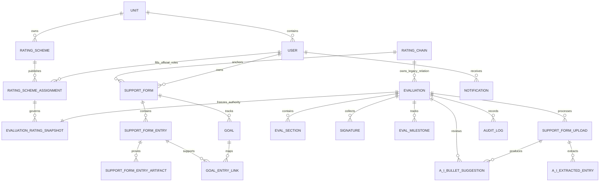

# 14 - Supabase PostgreSQL Database Schema Reference

> **Purpose:** A complete engineering and administration reference for the EES 2.0 PostgreSQL schema hosted by Supabase. It describes the intended application schema declared in `prisma/schema.prisma`, including tables, columns, enums, relationships, indexes, constraints, and database-adjacent Supabase services.

## Important deployment status

**As of 2026-07-17 14:00 UTC: All 14 migrations have been successfully applied to the configured Supabase datasource.**

The schema described herein (37 Prisma models, 53 enums, all relationships and indexes) is fully deployed and verified. The database has been confirmed to contain all expected tables and the test seed script completes successfully, creating 8 test personas, 2 rating-scheme assignments, 3 support forms, and 2 evaluations.

**Migration tracking caveat:** The `_prisma_migrations` metadata table experienced corruption during recovery. The migrations are applied (confirmed by successful seed), but `npx prisma migrate status` may not report correctly. For production deployments, use `prisma migrate deploy` as authoritative. Do not use `prisma db push` as a production substitute.

## Scope and source of truth

| Concern | Source of truth | Notes |
| --- | --- | --- |
| Application tables, columns, enum types, FK relationships, Prisma indexes | `ees2-backend/prisma/schema.prisma` | This document follows this file. Prisma model names normally map to the lowercase plural PostgreSQL table shown in each entry. |
| Database migration history | `ees2-backend/prisma/migrations/` | `prisma_migrations` in the database tracks which migration folders were applied. |
| Row-level security policies | `ees2-backend/supabase/rls-policies*.sql` | Policies are separate from Prisma and must be deployed independently where applicable. |
| Authentication identities | Supabase Auth `auth.users` | Not modelled by Prisma. `public.users.supabaseId` links an EES user to an Auth identity. |
| Object files | Supabase Storage | Not database rows in this schema. Database records hold object URLs, e.g. `fileUrl`. |
| Vector search | PostgreSQL `pgvector` extension + raw SQL | `regulation_chunks.embedding` is a `vector(1536)` column. It is intentionally marked `Unsupported` in Prisma. |

## Notation

| Notation | Meaning |
| --- | --- |
| `PK` | Primary key. All application tables use `String` CUID primary keys unless stated otherwise. |
| `FK -> table.column` | Foreign key relationship. |
| `?` | Nullable column. |
| `[]` | PostgreSQL array. For example, `String[]` is a text array and `UserRole[]` is an enum array. |
| `Json` | PostgreSQL JSON/JSONB value managed as Prisma `Json`. |
| `@default(...)` | Database default generated by Prisma. |
| `@updatedAt` | Prisma writes the timestamp on updates. |

## Entity relationship map

`A_I_BULLET_SUGGESTION` and `A_I_EXTRACTED_ENTRY` above correspond to the PostgreSQL tables `ai_bullet_suggestions` and `ai_extracted_entries`; Mermaid identifiers cannot reliably begin with digits or use mixed punctuation.

## Enum catalog

All enums below are PostgreSQL enum types created by Prisma migrations. Values are exact application values.

| Enum | Values |
| --- | --- |
| `Rank` | `PVT`, `PV2`, `PFC`, `SPC`, `CPL`, `SGT`, `SSG`, `SFC`, `MSG`, `FIRST_SERGEANT`, `SGM`, `CSM`, `SMA`, `WO1`, `CW2`, `CW3`, `CW4`, `CW5`, `SECOND_LT`, `FIRST_LT`, `CPT`, `MAJ`, `LTC`, `COL`, `BG`, `MG`, `LTG`, `GEN`, `GA` |
| `UserRole` | `SOLDIER`, `RATER`, `SENIOR_RATER`, `REVIEWER`, `COMMANDER`, `ADMIN` |
| `IdentitySourceSystem` | `NOT_CONFIGURED`, `IPPS_A`, `DEFENSE_MANPOWER`, `DEVELOPMENT_SEED` |
| `IdentitySyncStatus` | `CURRENT`, `STALE`, `PENDING`, `FAILED`, `UNMATCHED`, `NOT_CONFIGURED` |
| `ApplicationAccessStatus` | `ACTIVE`, `SUSPENDED`, `PENDING_REVIEW`, `DISABLED`, `LOCKED` |
| `AccessReviewStatus` | `CURRENT`, `PENDING_REVIEW`, `EXCEPTION_REVIEW` |
| `ApplicationSupportRole` | `NONE`, `SUPPORT`, `ADMINISTRATOR` |
| `IdentityExceptionType` | `DUPLICATE_IDENTITY`, `UNMATCHED_AUTH_ACCOUNT`, `MISSING_SOURCE_RECORD`, `STALE_SOURCE_DATA`, `UNIT_MAPPING_FAILURE`, `IDENTIFIER_CONFLICT`, `INVALID_ASSIGNMENT`, `SYNC_FAILURE`, `MANUAL_OVERRIDE_REVIEW` |
| `IdentityExceptionStatus` | `OPEN`, `RESOLVED`, `ESCALATED` |
| `AdministrativeScopeType` | `IDENTITY_ACCESS`, `SERVICING_ADMINISTRATION`, `BREAK_GLASS` |
| `SoldierCategory` | `OFFICER`, `NCO`, `WARRANT`, `CIVILIAN` |
| `RatingAssignmentStatus` | `DRAFT`, `APPROVED`, `PUBLISHED`, `SUPERSEDED`, `CANCELLED`, `QUARANTINED` |
| `RatingSchemeStatus` | `DRAFT`, `IN_VALIDATION`, `PENDING_APPROVAL`, `RETURNED`, `APPROVED`, `PUBLISHED`, `SUPERSEDED`, `CANCELLED` |
| `RatingSchemeDelegationStatus` | `ACTIVE`, `EXPIRED`, `REVOKED`, `SUSPENDED` |
| `RatingSchemeDelegationPermission` | `CREATE_DRAFT`, `EDIT_DRAFT`, `IMPORT_ASSIGNMENTS`, `RESOLVE_VALIDATION`, `SUBMIT_FOR_APPROVAL`, `VIEW_AUDIT` |
| `BattalionCommandAssignmentStatus` | `ACTIVE`, `ENDED`, `SUSPENDED` |
| `EvalFormType` | `NCOER_9_1`, `NCOER_9_2`, `NCOER_9_3`, `OER_67_10_1`, `OER_67_10_1A`, `OER_67_10_2`, `OER_67_10_2A`, `OER_67_10_3`, `OER_67_10_4` |
| `EvalCategory` | `NCOER`, `OER` |
| `RatingBinary` | `MET_STANDARD`, `DID_NOT_MEET_STANDARD` |
| `RatingFourLevel` | `NOT_MET_STANDARD`, `QUALIFIED`, `EXCEEDED_STANDARD`, `FAR_EXCEEDED_STANDARD` |
| `SeniorRaterRating` | `MOST_QUALIFIED`, `HIGHLY_QUALIFIED`, `QUALIFIED`, `NOT_QUALIFIED` |
| `EvalStatus` | `DRAFT`, `RATER_IN_PROGRESS`, `PENDING_SENIOR_RATER`, `PENDING_SOLDIER_ACK`, `PENDING_SUPPLEMENTARY_REVIEW`, `PENDING_FINAL_FORM_REVIEW`, `COMPLETE`, `SUBMITTED`, `ACCEPTED`, `RETURNED` |
| `SectionKey` | `CHARACTER`, `PRESENCE`, `INTELLECT`, `LEADS`, `DEVELOPS`, `ACHIEVES`, `RATER_OVERALL`, `SENIOR_RATER_OVERALL`, `SOLDIER_COMMENTS` |
| `EntryType` | `OBJECTIVE`, `ACCOMPLISHMENT` |
| `GoalCategory` | `ROUTINE`, `PROBLEM_SOLVING`, `INNOVATIVE`, `PERSONAL_DEVELOPMENT`, `OTHER` |
| `GoalApprovalStatus` | `DRAFT`, `PENDING_RATER_REVIEW`, `APPROVED`, `NEEDS_REVISION` |
| `GoalProgress` | `NOT_STARTED`, `IN_PROGRESS`, `ACHIEVED`, `PARTIALLY_ACHIEVED`, `NOT_ACHIEVED` |
| `FinalReviewOutcome` | `CONFIRMED`, `DISPUTED` |
| `DisputeCategory` | `RATER_CONTENT`, `SENIOR_RATER_CONTENT` |
| `EntryConfirmationStatus` | `UNREVIEWED`, `CONFIRMED`, `NEEDS_CLARIFICATION`, `NOT_USED` |
| `SupportFormStatus` | `DRAFT`, `INITIAL_COUNSELING_COMPLETE`, `ACTIVE`, `FINALIZED`, `CONSUMED`, `ARCHIVED`, `QUARANTINED` |
| `EntryAuthorRole` | `RATED_SOLDIER`, `RATER`, `INTERMEDIATE_RATER`, `SENIOR_RATER`, `SERVICING_ADMIN` |
| `RecordDisposition` | `ACTIVE`, `QUARANTINED`, `ARCHIVED` |
| `SignatureStatus` | `NOT_REQUIRED`, `PENDING`, `SIGNED`, `DECLINED` |
| `SupportFormUploadStatus` | `PENDING_EXTRACT`, `EXTRACTING`, `PENDING_PARSE`, `PARSING`, `PENDING_BULLETS`, `GENERATING`, `COMPLETE`, `FAILED` |
| `AIBulletStatus` | `PENDING_REVIEW`, `ACCEPTED`, `EDITED`, `REJECTED` |
| `AIBulletConfidence` | `HIGH`, `MEDIUM`, `LOW` |
| `StaleReason` | `FIELD_EDIT`, `ADMIN_CORRECTION` |
| `CounselingType` | `INITIAL`, `QUARTERLY` |
| `ArtifactType` | `CERTIFICATE`, `SCORE_SHEET`, `PHOTO`, `DOCUMENT`, `OTHER` |
| `ArtifactCaptionStatus` | `PENDING`, `COMPLETE`, `FAILED` |
| `ReturnReason` | `ADMIN_ERROR`, `PROHIBITED_LANGUAGE`, `MISSING_SIGNATURE`, `RATING_PERIOD_ERROR`, `OTHER` |
| `NotificationCategory` | `EVAL_LIFECYCLE`, `MILESTONE`, `COLLABORATION`, `DELEGATE`, `SYSTEM` |
| `MilestoneType` | `INITIAL_COUNSELING_DUE`, `QUARTERLY_COUNSELING_1`, `QUARTERLY_COUNSELING_2`, `QUARTERLY_COUNSELING_3`, `RATER_SECTION_DUE`, `SENIOR_RATER_DUE`, `SOLDIER_ACK_DUE`, `EVAL_SUBMISSION_DUE` |
| `MilestoneStatus` | `UPCOMING`, `DUE_SOON`, `OVERDUE`, `COMPLETE`, `WAIVED` |
| `CommentStatus` | `OPEN`, `RESOLVED`, `ACKNOWLEDGED` |
| `DelegateAccessLevel` | `VIEW_ONLY`, `PUSH_ALONG` |
| `DelegationType` | `PERSONAL_ASSISTANT`, `RATING_OFFICIAL_ASSISTANT`, `SERVICING_ADMIN_ASSIGNMENT` |
| `DelegationStatus` | `PENDING`, `ACTIVE`, `DECLINED`, `EXPIRED`, `REVOKED`, `SUSPENDED` |
| `DelegationCapability` | `VIEW_WORKFLOW_STATUS`, `VIEW_ADMINISTRATIVE_DATA`, `VIEW_SUPPORT_FORM`, `VIEW_PERMITTED_EVALUATION_DATA`, `ADD_DRAFT_SUPPORT_ENTRY`, `EDIT_OWN_DRAFT_SUPPORT_ENTRY`, `UPLOAD_ARTIFACT`, `ORGANIZE_ARTIFACT`, `COMPLETE_ADMINISTRATIVE_FIELD`, `RESPOND_TO_ADMIN_RETURN`, `REQUEST_SOLDIER_REVIEW`, `REQUEST_RATER_REVIEW`, `SEND_WORKFLOW_REMINDER`, `DOWNLOAD_WORKING_COPY`, `ADD_NON_EVALUATIVE_COMMENT` |

## Table reference

### Organization, users, and identity/access

#### `units` (`Unit`)

| Column | Type | Notes |
| --- | --- | --- |
| `id` | `String` PK | CUID. |
| `name` | `String` | Required unit display name. |
| `uic` | `String?` | Unique Unit Identification Code. |
| `parentId` | `String?` FK -> `units.id` | Optional self-referencing hierarchy. |
| `createdAt`, `updatedAt` | `DateTime` | Creation and mutation timestamps. |

Relations: one unit has many users, rating schemes, rating-scheme assignments, delegations, command assignments, access grants, and administrative scopes. `parentId` creates the unit tree.

#### `users` (`User`)

| Column | Type | Notes |
| --- | --- | --- |
| `id` | `String` PK | CUID. |
| `supabaseId` | `String` | Unique link to Supabase Auth identity. |
| `email` | `String` | Unique email address. |
| `firstName`, `lastName` | `String` | Required person name. |
| `rank` | `Rank` | Required Army rank enum. |
| `mos` | `String` | Required MOS/occupation identifier. |
| `roles` | `UserRole[]` | Application roles array. |
| `profilePictureUrl` | `String?` | Optional profile image URL. |
| `notificationPreferences` | `Json?` | Per-notification-category preference map. |
| `unitId` | `String?` FK -> `units.id` | Optional home unit. |
| `dodid` | `String?` | Unique when present; future CAC integration identifier. |
| `lastLoginAt` | `DateTime?` | Latest dashboard-login time. |
| `category` | `SoldierCategory?` | Officer/NCO/warrant/civilian category. |
| `applicationAccessStatus` | `ApplicationAccessStatus` | Default `ACTIVE`. EES access state, not personnel status. |
| `accessReviewStatus` | `AccessReviewStatus` | Default `CURRENT`. |
| `applicationSupportRole` | `ApplicationSupportRole` | Default `NONE`. |
| `suspensionReason`, `suspendedAt`, `suspendedByUserId` | `String?`, `DateTime?`, `String?` | Suspension metadata. |
| `breakGlassEligible` | `Boolean` | Default `false`. |
| `temporaryAdminExpiresAt` | `DateTime?` | Temporary elevated-access expiry. |
| `createdAt`, `updatedAt` | `DateTime` | Creation and mutation timestamps. |

Relationships: users participate as the rated soldier, rater, senior rater, reviewer, assignment official, commander, delegate, support-entry creator/subject, auditor, notification recipient, signature owner, and comment author. Related identity records are described below.

#### `identity_source_records` (`IdentitySourceRecord`)

| Column | Type | Notes |
| --- | --- | --- |
| `id` | `String` PK | CUID. |
| `userId` | `String` unique FK -> `users.id` | One source record per EES user; cascade delete. |
| `sourceSystem` | `IdentitySourceSystem` | Default `NOT_CONFIGURED`. |
| `authoritativePersonId`, `authoritativeEmail`, `dutyPosition` | `String?` | Values from the authoritative source. |
| `sourcePayload` | `Json?` | Source-system response payload. |
| `syncStatus` | `IdentitySyncStatus` | Default `NOT_CONFIGURED`. |
| `lastSynchronizedAt`, `lastSyncAttemptAt` | `DateTime?` | Synchronization timing. |
| `syncError` | `String?` | Most recent synchronization error. |
| `createdAt`, `updatedAt` | `DateTime` | Timestamps. |

#### `identity_sync_events` (`IdentitySyncEvent`)

| Column | Type | Notes |
| --- | --- | --- |
| `id` | `String` PK | CUID. |
| `userId` | `String` FK -> `users.id` | Cascade delete. |
| `sourceSystem`, `status` | `IdentitySourceSystem`, `IdentitySyncStatus` | Source and outcome. |
| `action` | `String` | Synchronization action name. |
| `details` | `Json?` | Event details. |
| `initiatedById` | `String?` | Actor identifier, not currently declared as a Prisma FK. |
| `createdAt` | `DateTime` | Event timestamp. |

Index: `(userId, createdAt)`.

#### `identity_exceptions` (`IdentityException`)

| Column | Type | Notes |
| --- | --- | --- |
| `id` | `String` PK | CUID. |
| `userId` | `String?` FK -> `users.id` | Set to null if the user is deleted. |
| `type`, `status` | `IdentityExceptionType`, `IdentityExceptionStatus` | Default status `OPEN`. |
| `severity` | `String` | Default `MEDIUM`. |
| `summary` | `String` | Required human-readable issue summary. |
| `details` | `Json?` | Structured exception details. |
| `resolvedAt`, `resolvedById`, `resolutionNote` | `DateTime?`, `String?`, `String?` | Resolution metadata; resolver identifier is not a Prisma FK. |
| `createdAt`, `updatedAt` | `DateTime` | Timestamps. |

Indexes: `(status, type)` and `(userId, status)`.

#### `administrative_scopes` (`AdministrativeScope`)

| Column | Type | Notes |
| --- | --- | --- |
| `id` | `String` PK | CUID. |
| `administratorId` | `String` FK -> `users.id` | Cascade delete. |
| `unitId` | `String?` FK -> `units.id` | Set to null if the unit is deleted. |
| `scopeType` | `AdministrativeScopeType` | Default `IDENTITY_ACCESS`. |
| `expiresAt` | `DateTime?` | Optional scope expiry. |
| `createdById` | `String?` | Creator identifier, not currently a Prisma FK. |
| `createdAt`, `updatedAt` | `DateTime` | Timestamps. |

Index: `(administratorId, scopeType)`.

#### `manual_overrides` (`ManualOverride`)

| Column | Type | Notes |
| --- | --- | --- |
| `id` | `String` PK | CUID. |
| `userId` | `String` FK -> `users.id` | Cascade delete. |
| `field` | `String` | Overridden application field. |
| `value` | `Json?` | Replacement value. |
| `reason` | `String` | Required justification. |
| `expiresAt` | `DateTime?` | Optional override expiry. |
| `createdById`, `reviewedById` | `String` | Administrative actor identifiers; not Prisma FKs. |
| `reviewedAt`, `createdAt` | `DateTime?`, `DateTime` | Review and creation timestamps. |

Index: `(userId, expiresAt)`.

### Rating governance and legacy chains

#### `rating_schemes` (`RatingScheme`)

| Column | Type | Notes |
| --- | --- | --- |
| `id` | `String` PK | CUID. |
| `unitId`, `battalionId` | `String` FK -> `units.id` | Both cascade on unit deletion. |
| `version` | `Int` | Unique per `unitId`. |
| `status` | `RatingSchemeStatus` | Default `DRAFT`. |
| `effectiveFrom`, `effectiveTo` | `DateTime`, `DateTime?` | Effective-dated scheme. |
| `createdByUserId` | `String` FK -> `users.id` | Required creator. |
| `submittedByUserId`, `approvedByUserId`, `publishedByUserId`, `returnedByUserId` | `String?` FK -> `users.id` | Lifecycle actors. |
| `submittedAt`, `approvedAt`, `publishedAt`, `returnedAt` | `DateTime?` | Lifecycle timestamps. |
| `approvalAuthorityPositionId` | `String?` | Authority identifier. |
| `approvalComments`, `returnComments`, `changeReason` | `String?` | Lifecycle narrative. |
| `previousSchemeId` | `String?` FK -> `rating_schemes.id` | Self-referencing replacement chain. |
| `versionHash` | `String?` | Immutable-version/hash indicator. |
| `createdAt`, `updatedAt` | `DateTime` | Timestamps. |

Constraints/indexes: unique `(unitId, version)`; indexes `(unitId, status, effectiveFrom)` and `(battalionId, status, effectiveFrom)`.

#### `rating_scheme_assignments` (`RatingSchemeAssignment`)

| Column | Type | Notes |
| --- | --- | --- |
| `id` | `String` PK | CUID. |
| `ratingSchemeId` | `String?` FK -> `rating_schemes.id` | Set to null if the scheme is deleted. |
| `ratedSoldierId`, `raterId`, `seniorRaterId` | `String` FK -> `users.id` | Required rating officials. |
| `intermediateRaterId`, `supplementaryReviewerId` | `String?` FK -> `users.id` | Optional officials. |
| `unitId` | `String?` FK -> `units.id` | Optional unit. |
| `formCategory` | `EvalCategory` | NCOER or OER category. |
| `effectiveFrom`, `effectiveTo` | `DateTime`, `DateTime?` | Effective date window. |
| `status` | `RatingAssignmentStatus` | Default `DRAFT`. |
| `requiresSupplementaryReview` | `Boolean` | Default `false`. |
| `changeReason`, `exceptionToPolicyId` | `String?` | Assignment exception/change metadata. |
| `supersedesAssignmentId` | `String?` FK -> self | Prospective replacement relationship. |
| `approvedByUserId`, `publishedByUserId`, `createdByUserId` | `String?` FK -> `users.id` | Lifecycle actors. |
| `approvedAt`, `publishedAt` | `DateTime?` | Lifecycle timestamps. |
| `createdAt`, `updatedAt` | `DateTime` | Timestamps. |

Indexes: `(ratedSoldierId, status, effectiveFrom)`, `(status, effectiveFrom)`, `(ratingSchemeId, effectiveFrom)`.

#### `battalion_command_assignments` (`BattalionCommandAssignment`)

| Column | Type | Notes |
| --- | --- | --- |
| `id` | `String` PK | CUID. |
| `battalionId` | `String` FK -> `units.id` | Cascade delete. |
| `commanderUserId` | `String` FK -> `users.id` | Cascade delete. |
| `status` | `BattalionCommandAssignmentStatus` | Default `ACTIVE`. |
| `effectiveFrom`, `effectiveTo` | `DateTime`, `DateTime?` | Effective date window. |
| `createdAt`, `updatedAt` | `DateTime` | Timestamps. |

Indexes: `(battalionId, status, effectiveFrom)` and `(commanderUserId, status)`.

#### `rating_scheme_delegations` (`RatingSchemeDelegation`)

| Column | Type | Notes |
| --- | --- | --- |
| `id` | `String` PK | CUID. |
| `battalionId` | `String` FK -> `units.id` | Cascade delete. |
| `commanderUserId`, `delegateUserId` | `String` FK -> `users.id` | Required principal and delegate. |
| `effectiveFrom`, `effectiveTo` | `DateTime`, `DateTime?` | Effective date window. |
| `status` | `RatingSchemeDelegationStatus` | Default `ACTIVE`. |
| `permissions` | `RatingSchemeDelegationPermission[]` | Capability array. |
| `grantedByUserId`, `revokedByUserId` | `String`, `String?` FK -> `users.id` | Grant/revocation actors. |
| `grantedAt`, `revokedAt` | `DateTime`, `DateTime?` | Lifecycle timestamps. |
| `createdAt`, `updatedAt` | `DateTime` | Timestamps. |

Indexes: `(battalionId, delegateUserId, status)` and `(commanderUserId, status)`.

#### `rating_chains` (`RatingChain`)

| Column | Type | Notes |
| --- | --- | --- |
| `id` | `String` PK | CUID. |
| `ratedSoldierId`, `raterId`, `seniorRaterId` | `String` FK -> `users.id` | Required legacy relationship officials. |
| `reviewerId` | `String?` FK -> `users.id` | Optional supplementary reviewer. |
| `effectiveDate`, `endDate` | `DateTime`, `DateTime?` | Effective interval. |
| `isActive` | `Boolean` | Default `true`. |
| `createdAt`, `updatedAt` | `DateTime` | Timestamps. |

This is retained for compatibility. Newer assignment-backed work uses `rating_scheme_assignments` and freezes officials in `evaluation_rating_snapshots`.

#### `evaluation_rating_snapshots` (`EvaluationRatingSnapshot`)

| Column | Type | Notes |
| --- | --- | --- |
| `id` | `String` PK | CUID. |
| `evaluationId` | `String` unique FK -> `evaluations.id` | Cascade delete; one immutable snapshot per evaluation. |
| `ratingSchemeAssignmentId` | `String` FK -> `rating_scheme_assignments.id` | Originating assignment. |
| `ratedSoldierId`, `raterId`, `seniorRaterId` | `String` | Frozen official IDs. |
| `intermediateRaterId`, `supplementaryReviewerId` | `String?` | Optional frozen official IDs. |
| `ratedRank`, `raterRank`, `seniorRaterRank` | `Rank` | Frozen ranks. |
| `ratedCategory`, `raterCategory`, `seniorRaterCategory` | `SoldierCategory` | Frozen categories. |
| `formCategory` | `EvalCategory` | Frozen NCOER/OER type family. |
| `ratedGrade` | `String` | Frozen grade display/value. |
| `exceptionToPolicyId` | `String?` | Assignment exception reference. |
| `createdAt` | `DateTime` | Snapshot time. |

Index: `(ratingSchemeAssignmentId)`.

### Support forms, entries, evidence, goals, and counseling

#### `support_forms` (`SupportForm`)

| Column | Type | Notes |
| --- | --- | --- |
| `id` | `String` PK | CUID. |
| `soldierId` | `String` FK -> `users.id` | Required form owner. |
| `ratingChainId` | `String?` FK -> `rating_chains.id` | Legacy anchor, nullable for migration compatibility. |
| `ratingSchemeAssignmentId` | `String?` FK -> `rating_scheme_assignments.id` | Versioned-assignment anchor. |
| `evalCategory` | `EvalCategory?` | Form category captured at creation. |
| `ratingPeriodStart`, `ratingPeriodEnd` | `DateTime`, `DateTime?` | Rating interval. |
| `dutyTitle`, `dutyMosc` | `String`, `String?` | Duty fields; MOSC is NCO-specific. |
| `dailyDutiesScope`, `areasOfEmphasis`, `appointedDuties` | `String?` | Duty-description text. |
| `ssdNcoesMet` | `Boolean?` | NCO education prerequisite state. |
| `soldierGoals`, `raterContextNote` | `String?` | Form-wide goals/context. |
| `raterContextNoteSetById`, `raterContextNoteSetAt` | `String?`, `DateTime?` | Context-note attribution. |
| `isActive` | `Boolean` | Default `true`. |
| `status` | `SupportFormStatus` | Default `DRAFT`. |
| `disposition` | `RecordDisposition` | Default `ACTIVE`. |
| `initiatedByUserId` | `String?` | Initiator identifier. |
| `initialCounselingDate`, `finalizedAt` | `DateTime?` | Lifecycle dates. |
| `consumedByEvaluationId`, `consumedAt` | `String?`, `DateTime?` | Evaluation-consumption metadata. |
| `version` | `Int` | Default `1`. |
| `parentFormId` | `String?` | Version/carry-forward reference. |
| `completedAt` | `DateTime?` | Hard-completeness gate for evaluation creation. |
| `createdAt`, `updatedAt` | `DateTime` | Timestamps. |

#### `support_form_entries` (`SupportFormEntry`)

| Column | Type | Notes |
| --- | --- | --- |
| `id` | `String` PK | CUID. |
| `supportFormId` | `String` FK -> `support_forms.id` | Parent support form. |
| `entryDate` | `DateTime` | Default current time. |
| `section`, `entryType` | `SectionKey`, `EntryType` | Evaluation area and objective/accomplishment classification. |
| `rawText` | `String` | Required submitted content. |
| `createdByUserId`, `lastEditedByUserId`, `onBehalfOfUserId` | `String?` | Creator/editor/assistance attribution; creator and subject have Prisma FKs to users. |
| `authorRoleAtCreation` | `EntryAuthorRole?` | Role at entry creation. |
| `delegationGrantId` | `String?` | Assistance grant reference identifier. |
| `lockedAt`, `lockReason` | `DateTime?`, `String?` | Entry lock metadata. |
| `sourceVersion` | `Int` | Default `1`. |
| `tags` | `String[]` | Free-form tag array. |
| `isHighlight`, `counseled` | `Boolean` | Both default `false`. |
| `counseledDate` | `DateTime?` | Counseling linkage date. |
| `usedInEvalId` | `String?` | Evaluation usage marker. |
| `confirmationStatus` | `EntryConfirmationStatus` | Default `UNREVIEWED`. |
| `confirmedById`, `confirmedAt`, `clarificationNote` | `String?`, `DateTime?`, `String?` | Rater-review metadata. |
| `createdAt`, `updatedAt` | `DateTime` | Timestamps. |

Relationships: one entry has many artifacts and can link to many goals through `goal_entry_links`.

#### `support_form_entry_artifacts` (`SupportFormEntryArtifact`)

| Column | Type | Notes |
| --- | --- | --- |
| `id` | `String` PK | CUID. |
| `entryId` | `String` FK -> `support_form_entries.id` | Parent performance entry. |
| `createdByUserId`, `lastEditedByUserId`, `onBehalfOfUserId`, `delegationGrantId` | `String?` | Attribution/assistance identifiers. |
| `type` | `ArtifactType` | Required evidence category. |
| `fileUrl`, `fileType` | `String`, `String` | Supabase Storage URL and image/PDF classification. |
| `aiCaption` | `String?` | Extracted factual caption. |
| `aiCaptionStatus` | `ArtifactCaptionStatus` | Default `PENDING`. |
| `aiCaptionError` | `String?` | Caption-generation failure detail. |
| `flaggedByServiceMember` | `Boolean` | Default `false`; self-attestation/iPERMS discrepancy disclosure. |
| `flagNote` | `String?` | Required by route policy when the flag is true. |
| `createdAt`, `updatedAt` | `DateTime` | Timestamps. |

#### `goals` (`Goal`)

| Column | Type | Notes |
| --- | --- | --- |
| `id` | `String` PK | CUID. |
| `supportFormId` | `String` FK -> `support_forms.id` | Cascade delete. |
| `sectionKey` | `SectionKey` | Related leadership dimension. |
| `title`, `description` | `String` | Required goal text. |
| `category` | `GoalCategory?` | Optional category. |
| `targetDate` | `DateTime?` | Optional target. |
| `createdById`, `lastEditedById` | `String`, `String?` | Creator/editor identifiers. |
| `createdByRole` | `EntryAuthorRole` | Required creator role. |
| `lastEditedAt` | `DateTime?` | Latest edit time. |
| `approvalStatus` | `GoalApprovalStatus` | Default `DRAFT`. |
| `approvedByRaterId`, `approvedAt`, `revisionNote` | `String?`, `DateTime?`, `String?` | Approval/revision metadata. |
| `establishedAtCounselingSessionId` | `String?` | Counseling reference identifier. |
| `soldierAssessment`, `raterAssessment` | `GoalProgress?` | Progress statements. |
| `soldierAssessmentNote`, `raterAssessmentNote` | `String?` | Narrative assessment. |
| `soldierAssessmentAt`, `raterAssessmentAt` | `DateTime?` | Assessment timestamps. |
| `raterAssessmentById` | `String?` | Rater assessment actor. |
| `carriedForwardFromGoalId` | `String?` FK -> `goals.id` | Self-referencing carry-forward. |
| `createdAt`, `updatedAt` | `DateTime` | Timestamps. |

Index: `(supportFormId, sectionKey)`.

#### `goal_entry_links` (`GoalEntryLink`)

| Column | Type | Notes |
| --- | --- | --- |
| `id` | `String` PK | CUID. |
| `goalId` | `String` FK -> `goals.id` | Cascade delete. |
| `supportFormEntryId` | `String` FK -> `support_form_entries.id` | Cascade delete. |
| `linkedById`, `linkedByRole` | `String`, `EntryAuthorRole` | Required actor and role. |
| `linkedAt` | `DateTime` | Default current time. |

Unique constraint: `(goalId, supportFormEntryId)`.

#### `performance_observations` (`PerformanceObservation`)

Rater-owned factual observations are deliberately separate from Soldier-authored `support_form_entries`. They are private to the assigned rater until the rater discusses and releases them through a counseling session; counseling never changes the original author, note, occurrence date, or creation time.

| Column | Type | Notes |
| --- | --- | --- |
| `id` | `String` PK | CUID. |
| `supportFormId` | `String` FK -> `support_forms.id` | Cascade delete; required current-period context. |
| `ratedSoldierId`, `observerId` | `String` FK -> `users.id` | Rated Soldier and assigned-rater author are stored separately. |
| `goalId` | `String?` FK -> `goals.id` | Optional approved-goal traceability link; set null if the goal is deleted. |
| `sectionKey` | `SectionKey` | Leadership dimension. |
| `feedbackType` | `ObservationFeedbackType` | Explicit `POSITIVE`, `DEVELOPMENTAL`, or `NEUTRAL`. |
| `factualNote`, `tags` | `String`, `String[]` | Required factual note and up to two operational tags at the API boundary. |
| `occurredAt` | `DateTime` | When the rater observed the performance. |
| `releaseState` | `ObservationReleaseState` | `PRIVATE_TO_RATER` until counseling release; then `RELEASED_IN_COUNSELING`. |
| `discussedAt`, `discussedInCounselingSessionId` | `DateTime?`, `String?` FK -> `counseling_sessions.id` | Release/discussion metadata; does not rewrite original observation facts. |
| `lastEditedAt`, `lastEditedById` | `DateTime?`, `String?` | Rater edit attribution. |
| `createdAt`, `updatedAt` | `DateTime` | Timestamps. |

Indexes: `(supportFormId, occurredAt)`, `(goalId)`, and `(ratedSoldierId, releaseState)`.

#### `counseling_sessions` (`CounselingSession`)

| Column | Type | Notes |
| --- | --- | --- |
| `id` | `String` PK | CUID. |
| `ratingChainId` | `String` FK -> `rating_chains.id` | Required legacy chain. |
| `type` | `CounselingType` | Initial or quarterly. |
| `sessionDate` | `DateTime` | Required session date. |
| `notes` | `String?` | Counseling record. |
| `officialRecordReference`, `officialRecordUrl` | `String?`, `String?` | Optional reference/link to the completed official DA Form 4856 or unit record. This is a reconciliation pointer only; MERIT does not store or generate an official DA 4856 in this release. |
| `raterInitials`, `soldierInitials` | `String?` | Recorded acknowledgements. |
| `createdAt`, `updatedAt` | `DateTime` | Timestamps. |

#### `goal_counseling_discussions` (`GoalCounselingDiscussion`)

| Column | Type | Notes |
| --- | --- | --- |
| `id` | `String` PK | CUID. |
| `goalId` | `String` FK -> `goals.id` | Cascade delete. |
| `counselingSessionId` | `String` FK -> `counseling_sessions.id` | Cascade delete. |
| `note` | `String?` | Discussion narrative. |
| `percentAchieved` | `Int?` | Progress percentage. |
| `setById` | `String` | Actor identifier. |
| `createdAt`, `updatedAt` | `DateTime` | Timestamps. |

Unique constraint: `(goalId, counselingSessionId)`.

### Evaluations, signatures, workflow, and collaboration

#### `evaluations` (`Evaluation`)

| Column | Type | Notes |
| --- | --- | --- |
| `id` | `String` PK | CUID. |
| `ratingChainId` | `String` FK -> `rating_chains.id` | Required legacy relationship. |
| `supportFormId` | `String?` FK -> `support_forms.id` | Supporting form when linked. |
| `formType` | `EvalFormType` | Required DA form type. |
| `status` | `EvalStatus` | Default `DRAFT`; recomputed from workflow state by application code. |
| `disposition` | `RecordDisposition` | Default `ACTIVE`. |
| `requiresSupplementaryReview` | `Boolean` | Default `false`. |
| `periodStart`, `periodEnd` | `DateTime` | Rating period. |
| `ratedMonths`, `nonRatedMonths` | `Int` | Required rated months; non-rated default `0`. |
| `nonRatedCodes` | `String?` | Applicable non-rated-time codes. |
| `reasonForSubmission` | `String` | Required submission reason. |
| `statusCode` | `String?` | Personnel status code. |
| `numberOfEnclosures` | `Int` | Default `0`. |
| `principalDutyTitle`, `dutyMosc`, `dailyDutiesScope`, `areasOfSpecialEmphasis`, `appointedDuties` | `String?` | Part III duty data. |
| `successiveAssignment1`, `successiveAssignment2`, `broadeningAssignment` | `String?` | Part V succession planning. |
| `seniorRaterRating` | `SeniorRaterRating?` | Senior-rater overall assessment. |
| `acftPassFail` | `String?` | Pass/fail/profile outcome. |
| `acftDate` | `DateTime?` | Test date. |
| `heightInches`, `weightLbs` | `Int?` | Height/weight data. |
| `withinWeightStandard` | `Boolean?` | Weight standard result. |
| `submittedAt`, `acceptedAt` | `DateTime?` | HRC lifecycle timestamps. |
| `createdAt`, `updatedAt` | `DateTime` | Timestamps. |

Relationships: evaluation sections, signatures, returns, milestones, comments, notifications, audit rows, uploads, AI suggestions, final-form reviews, access grants, and an optional immutable rating snapshot.

#### `eval_sections` (`EvalSection`)

| Column | Type | Notes |
| --- | --- | --- |
| `id` | `String` PK | CUID. |
| `evaluationId` | `String` FK -> `evaluations.id` | Required parent evaluation. |
| `section` | `SectionKey` | One record per evaluation/section pair. |
| `ratingBinary`, `ratingFourLevel` | `RatingBinary?`, `RatingFourLevel?` | Which one applies depends on form type. |
| `stagingBullets`, `finalBullets` | `String[]` | Both default to empty arrays. |
| `bulletSources` | `Json?` | Final-bullet-index -> `HUMAN`, `AI_MODIFIED`, or `AI_UNMODIFIED`. |
| `bulletProvenance` | `Json?` | Final-bullet-index -> source suggestion, entry IDs, and immutable source snapshot. |
| `isComplete` | `Boolean` | Default `false`. |
| `completedAt`, `completedById` | `DateTime?`, `String?` | Completion metadata. |
| `createdAt`, `updatedAt` | `DateTime` | Timestamps. |

Unique constraint: `(evaluationId, section)`.

#### `senior_rater_profiles` (`SeniorRaterProfile`)

| Column | Type | Notes |
| --- | --- | --- |
| `id` | `String` PK | CUID. |
| `userId` | `String` unique FK -> `users.id` | One profile per senior rater. |
| `profileData` | `Json` | Default `{}`; rating-distribution counts by grade. |
| `lastUpdated` | `DateTime` | Default current time. |

#### `final_form_reviews` (`FinalFormReview`)

| Column | Type | Notes |
| --- | --- | --- |
| `id` | `String` PK | CUID. |
| `evaluationId` | `String` FK -> `evaluations.id` | Cascade delete. |
| `reviewedBy` | `String` | Reviewer identifier. |
| `outcome` | `FinalReviewOutcome` | Confirmed or disputed. |
| `contentHash` | `String` | Reviewed document content hash. |
| `disputeCategory` | `DisputeCategory?` | Rater or senior-rater content. |
| `disputeReason` | `String?` | Required when applicable by route policy. |
| `reviewedAt`, `supersededAt` | `DateTime`, `DateTime?` | Review lifecycle. |

Index: `(evaluationId, reviewedAt)`.

#### `signatures` (`Signature`)

| Column | Type | Notes |
| --- | --- | --- |
| `id` | `String` PK | CUID. |
| `evaluationId`, `userId` | `String` FK -> `evaluations.id`, `users.id` | Required evaluation and signing user. |
| `role` | `UserRole` | Signing role. |
| `status` | `SignatureStatus` | Default `PENDING`. |
| `signedAt`, `declineReason`, `notifiedAt` | `DateTime?`, `String?`, `DateTime?` | Workflow metadata. |
| `nameConfirmation`, `ipAddress`, `userAgent` | `String?` | Consent and client-context metadata. |
| `cacCertSerial`, `pkiTokenHash` | `String?` | Future PKI/CAC fields. |
| `contentHash` | `String?` | Content hash at signature time. |
| `isStale` | `Boolean` | Default `false`. |
| `staledAt`, `staledByUserId` | `DateTime?`, `String?` | Stale-signature metadata. |
| `staledReason` | `StaleReason?` | Field edit or administrative correction. |
| `createdAt`, `updatedAt` | `DateTime` | Timestamps. |

Unique constraint: `(evaluationId, role)`.

#### `evaluation_returns` (`EvaluationReturn`)

| Column | Type | Notes |
| --- | --- | --- |
| `id` | `String` PK | CUID. |
| `evaluationId` | `String` FK -> `evaluations.id` | Required parent evaluation. |
| `returnReason` | `ReturnReason` | Required HRC/chain return category. |
| `returnedAt` | `DateTime` | Default current time. |
| `notes` | `String?` | Return detail. |
| `resolvedAt` | `DateTime?` | Resubmission/correction resolution. |
| `createdAt` | `DateTime` | Creation timestamp. |

#### `eval_milestones` (`EvalMilestone`)

| Column | Type | Notes |
| --- | --- | --- |
| `id` | `String` PK | CUID. |
| `evaluationId` | `String` FK -> `evaluations.id` | Required parent evaluation. |
| `type`, `status` | `MilestoneType`, `MilestoneStatus` | Status default `UPCOMING`. |
| `dueDate` | `DateTime` | Required AR 623-3 workflow date. |
| `completedAt` | `DateTime?` | Completion time. |
| `waivedAt`, `waivedById`, `waivedReason` | `DateTime?`, `String?`, `String?` | Waiver metadata. |
| `notifiedAt`, `escalatedAt` | `DateTime?` | Notification/escalation timing. |
| `createdAt`, `updatedAt` | `DateTime` | Timestamps. |

Unique constraint: `(evaluationId, type)`.

#### `eval_comments` (`EvalComment`)

| Column | Type | Notes |
| --- | --- | --- |
| `id` | `String` PK | CUID. |
| `evaluationId` | `String` FK -> `evaluations.id` | Required parent evaluation. |
| `sectionKey` | `SectionKey?` | Null for whole-evaluation comments. |
| `authorId` | `String` FK -> `users.id` | Required author. |
| `createdByUserId`, `lastEditedByUserId`, `onBehalfOfUserId`, `delegationGrantId` | `String?` | Attribution/assistance identifiers. |
| `content` | `String` | Required comment text. |
| `status` | `CommentStatus` | Default `OPEN`. |
| `resolvedById`, `resolvedAt` | `String?`, `DateTime?` | Resolution metadata. |
| `parentId` | `String?` FK -> `eval_comments.id` | Self-referencing threaded reply. |
| `createdAt`, `updatedAt` | `DateTime` | Timestamps. |

### Notifications, audit, and scoped assistance

#### `notifications` (`Notification`)

| Column | Type | Notes |
| --- | --- | --- |
| `id` | `String` PK | CUID. |
| `userId` | `String` FK -> `users.id` | Recipient. |
| `evaluationId` | `String?` FK -> `evaluations.id` | Optional evaluation context. |
| `category` | `NotificationCategory` | Default `SYSTEM`. |
| `title`, `message` | `String` | Required message content. |
| `actionUrl`, `actionLabel` | `String?` | Optional client route/action label. |
| `isDismissed` | `Boolean` | Default `false`. |
| `readAt` | `DateTime?` | Read timestamp. |
| `createdAt` | `DateTime` | Creation timestamp. |

#### `audit_logs` (`AuditLog`)

| Column | Type | Notes |
| --- | --- | --- |
| `id` | `String` PK | CUID. |
| `evaluationId` | `String?` FK -> `evaluations.id` | Optional evaluation context. |
| `actorId` | `String` FK -> `users.id` | Required action actor. |
| `action` | `String` | Action code, e.g. `PDF_EXPORTED`, `SUGGESTION_ACCEPTED`. |
| `entityType`, `entityId` | `String`, `String` | Required polymorphic resource target. |
| `metadata` | `Json?` | Structured event detail. |
| `subjectUserId`, `delegationGrantId` | `String?` | Subject/assistance identifiers. |
| `delegationCapability` | `DelegationCapability?` | Capability under which action occurred. |
| `requestId`, `ipAddress`, `userAgent` | `String?` | Request and client context. |
| `createdAt` | `DateTime` | Event time. |

The table is append-only by application convention. Prisma does not encode immutability; production permissions/RLS and route policy must prevent update/delete operations.

#### `delegates` (`Delegate`)

| Column | Type | Notes |
| --- | --- | --- |
| `id` | `String` PK | CUID. |
| `principalId`, `delegateUserId` | `String` FK -> `users.id` | Legacy principal/delegate relationship. |
| `accessLevel` | `DelegateAccessLevel` | Default `VIEW_ONLY`. |
| `effectiveDate`, `expiryDate` | `DateTime`, `DateTime?` | Legacy effective window. |
| `isActive` | `Boolean` | Default `true`. |
| `appointedReason` | `String?` | Legacy appointment rationale. |
| `grantorUserId`, `subjectUserId` | `String?` FK -> `users.id` | Additive access-grant principals. |
| `delegationType` | `DelegationType?` | Assistance class. |
| `status` | `DelegationStatus` | Default `PENDING`. |
| `effectiveFrom`, `effectiveTo` | `DateTime?` | Additive effective window. |
| `evaluationId`, `supportFormId`, `ratingAssignmentId`, `unitId` | `String?` FK | Optional resource scope. |
| `justification` | `String?` | Access rationale. |
| `requiresReview` | `Boolean` | Default `false`. |
| `createdByUserId`, `approvedByUserId`, `revokedByUserId` | `String?` | Lifecycle actor identifiers. |
| `acceptedAt`, `revokedAt` | `DateTime?` | Lifecycle times. |
| `revocationReason` | `String?` | Revocation narrative. |
| `createdAt`, `updatedAt` | `DateTime` | Timestamps. |

Index: `(principalId, delegateUserId)`. Capability rows are stored in `delegation_capability_grants`.

#### `delegation_capability_grants` (`DelegationCapabilityGrant`)

| Column | Type | Notes |
| --- | --- | --- |
| `id` | `String` PK | CUID. |
| `delegationGrantId` | `String` FK -> `delegates.id` | Cascade delete. |
| `capability` | `DelegationCapability` | Scoped allowed capability. |

Unique constraint: `(delegationGrantId, capability)`.

### AI, document ingestion, and regulation knowledge

#### `regulation_chunks` (`RegulationChunk`)

| Column | Type | Notes |
| --- | --- | --- |
| `id` | `String` PK | CUID. |
| `docTitle`, `section`, `heading`, `content` | `String` | Required regulation chunk fields. |
| `embedding` | `vector(1536)?` | Raw pgvector column. Prisma declares it `Unsupported("vector(1536)")`; only raw SQL reads/writes it. |
| `pageStart`, `pageEnd` | `Int?` | Source-document page range. |
| `createdAt` | `DateTime` | Creation timestamp. |

Index: `(docTitle, section)`. Vector index: `idx_regulation_chunks_embedding`, an `ivfflat` index using `vector_cosine_ops` (created by migration). **Do not remove the `Unsupported("vector(1536)")` schema field**: Prisma migrations previously interpreted the unmodelled raw column as removable and dropped it.

#### `support_form_uploads` (`SupportFormUpload`)

| Column | Type | Notes |
| --- | --- | --- |
| `id` | `String` PK | CUID. |
| `evaluationId` | `String` FK -> `evaluations.id` | Required target evaluation. |
| `uploadedById` | `String` FK -> `users.id` | Required uploader. |
| `fileUrl`, `fileType` | `String`, `String` | Supabase Storage URL and PDF/image category. |
| `parseStatus` | `SupportFormUploadStatus` | Default `PENDING_EXTRACT`. |
| `parseError`, `rawExtract` | `String?` | Failure detail and Stage 1 vision result. |
| `createdAt`, `updatedAt` | `DateTime` | Timestamps. |

Relations: one upload yields `ai_extracted_entries` and can produce `ai_bullet_suggestions`.

#### `ai_extracted_entries` (`AIExtractedEntry`)

| Column | Type | Notes |
| --- | --- | --- |
| `id` | `String` PK | CUID. |
| `uploadId` | `String` FK -> `support_form_uploads.id` | Required source upload. |
| `evaluationId` | `String` | Evaluation identifier retained with extraction; not declared as a Prisma FK. |
| `section` | `SectionKey` | Classified leadership dimension. |
| `what` | `String` | Required extracted action/fact. |
| `impact`, `date`, `context` | `String?` | Optional extracted support data. |
| `createdAt` | `DateTime` | Creation timestamp. |

#### `ai_bullet_suggestions` (`AIBulletSuggestion`)

| Column | Type | Notes |
| --- | --- | --- |
| `id` | `String` PK | CUID. |
| `evaluationId` | `String` FK -> `evaluations.id` | Required target evaluation. |
| `uploadId` | `String?` FK -> `support_form_uploads.id` | Present for whole-document upload path. |
| `sectionKey` | `SectionKey` | Required target form section. |
| `text` | `String` | Required AI candidate. |
| `confidence` | `AIBulletConfidence` | Default `MEDIUM`. |
| `rank` | `Int` | Candidate rank, `1` is best. |
| `status` | `AIBulletStatus` | Default `PENDING_REVIEW`. |
| `editedText` | `String?` | Rater-edited accepted text. |
| `reviewedById`, `reviewedAt` | `String?`, `DateTime?` | Review attribution/timing. |
| `sourceEntryIds` | `String[]` | Source support-entry or extracted-entry identifiers. |
| `evidenceReferences` | `Json?` | Versioned typed evidence references. Uses explicit kinds such as `SUPPORT_FORM_ENTRY` and `PERFORMANCE_OBSERVATION`; observation IDs never overload `sourceEntryIds`. |
| `sourceSnapshot` | `Json?` | Immutable generation-time entry text and artifact-caption snapshot. |
| `unsupportedClaims` | `Json?` | Deterministic unsupported-fact findings. |
| `createdAt`, `updatedAt` | `DateTime` | Timestamps. |

`sourceSnapshot` is deliberately denormalized historical evidence. It may contain Soldier accomplishments, rater observations, reviewed upload facts, artifact captions, goal context, observation author/timestamps, and counseling release state. It must not be rebuilt from current source rows, because later source edits/deletions must not alter the factual record of what the AI received at generation time.

## Important database rules and boundaries

1. **Application authorization is not entirely expressed as foreign keys.** The API applies rating-chain and assignment-snapshot authorization. A valid FK alone does not grant a user access to an evaluation.
2. **Lifecycle transitions are application rules.** Examples include recomputing `Evaluation.status`, blocking section completion while AI suggestions are pending, and consuming a support form when an evaluation is created.
3. **`Json` fields are contracts.** `notificationPreferences`, `sourcePayload`, `sourceSnapshot`, `unsupportedClaims`, `bulletSources`, `bulletProvenance`, `profileData`, and audit `metadata` should be changed only with versioned application handling.
4. **Supabase Storage is separate.** Deleting a database row does not automatically delete a referenced object unless the route explicitly deletes it from Storage.
5. **Raw identifiers are not always foreign keys.** Some administrative/attribution fields are intentionally stored as scalar IDs for migration compatibility or future integration. The table dictionary calls out fields that are not modelled as Prisma relationships.
6. **Audit immutability requires access control.** The schema records audit events, but a database table is only tamper-resistant when RLS, database grants, and application routes prohibit mutation/deletion.
7. **Vector columns need special care.** The pgvector `embedding` column is unsupported by Prisma Client and uses raw SQL. Its `Unsupported("vector(1536)")` declaration exists specifically to protect it from accidental removal during schema migration.

## Related documents

- [03 - Technical Architecture](./03-technical-architecture.md) for the application architecture and main data-flow narrative.
- [05 - Security and Compliance](./05-security-and-compliance.md) for authorization, RLS, audit, and compliance controls.
- [08 - Data Flow and API Contract](./08-data-flow-and-api-contract.md) for endpoint/lifecycle contract detail.
- [09 - Permission and Assignment Audit](./09-permission-and-assignment-audit.md) for legacy-data remediation and demo-data readiness.

---

**Maintenance rule:** update this document in the same change set as any Prisma schema or migration change. The `schema.prisma` file and reviewed migrations remain authoritative if this reference ever conflicts with code.
