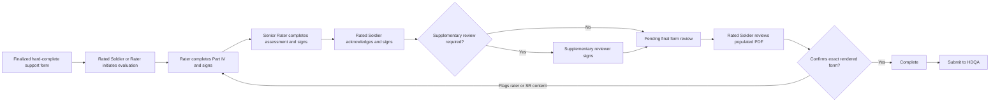

# EES 2.0 Workflow Test Runbook

## Purpose

This is the authoritative manual test guide for the regulated evaluation workflow. It reflects the implementation including versioned assignments, immutable evaluation snapshots, standalone support-form goals, ordered signatures, supplementary review, and final-form confirmation before submission.

For a customer-facing, checkbox-driven walkthrough and results template, use [12 - Customer Manual Acceptance Test Plan](./12-customer-manual-acceptance-test-plan.md).

Use the Davis NCOER path for the complete four-person workflow. Use the Torres OER path to verify officer assignment, form selection, and the MAJ senior-rater path. The OER builder is not yet at feature parity with the NCOER builder.

## Preconditions

1. Start the real backend, not the mock server:

```zsh
cd "/Users/peterscheuermann/Documents/Project Shit/EES2.0/ees2-backend"
npm run dev:real
```

Restart it after pulling these changes so the development-auth map includes MAJ Lee, LTC Reed, CPT Quinn, SGT Rivera, and SFC Morgan.

1. Start the frontend:

```zsh
cd "/Users/peterscheuermann/Documents/Project Shit/EES2.0/ees2-frontend"
npm run dev
```

1. Seed the isolated workflow fixtures once before the first run:

```zsh
cd "/Users/peterscheuermann/Documents/Project Shit/EES2.0/ees2-backend"
npx tsx scripts/seed-workflow-test-data.ts
```

The script is additive. It does not reactivate or modify quarantined legacy evaluations/support forms.

1. Seed Access and Assistance grants and verify their core authorization boundaries:

```zsh
npm run seed:access-assistance
npm run test:access-assistance
```

The helper fixture uses SGT Alex Rivera, who has no rating-official role. It demonstrates scoped assistance under the helper's own identity.

1. Open the frontend at `http://localhost:3000/dev-login` and choose the appropriate persona.

### Identity and Access Administration

1. Sign in as CPT Quinn and open `/admin/identity-access`.
2. Confirm the synchronized identities, exception, access-review, suspension, and unmatched-record metrics load with nonzero/zero values derived from the API, not placeholder values.
3. Select **Sync now** in the development environment; confirm the identity records show `DEVELOPMENT SEED` and `CURRENT` after the request completes.
4. Open a record and verify name, rank, unit, MOS, email, authentication ID, and source fields are read-only.
5. Inspect assignments, access grants, administrative scopes, exceptions, and audit history. Confirm rating authority appears only under assignments, not editable profile roles.
6. Update an EES support role, access-review state, break-glass eligibility, or temporary access expiration; confirm the action is recorded without changing the identity fields or any rating assignment.
7. Assign and remove a servicing-administrator scope; confirm scoped administrators are limited to their assigned unit records after a scope is present.
8. Suspend a non-admin test persona with a reason, confirm its EES access becomes `SUSPENDED`, then reactivate it and confirm `ACTIVE` is restored.
9. Sign in as a non-admin persona and confirm **Identity and Access** is absent from navigation; its API calls return `403` and the direct frontend route shows the dedicated access-denied view.
10. In development only, open `/dev/personas` to create/reset test personas. Do not use this route as a personnel onboarding workflow.

## Test Cast

| Persona | Login profile | Workflow responsibility |
| --- | --- | --- |
| SGT James Davis | `SGT Davis - Team Leader` | Rated Soldier for the full NCOER workflow. |
| SSG Marcus Johnson | `SSG Johnson - Squad Leader` | Davis's rater; completes Part IV rater content. |
| SFC Robert Williams | `SFC Williams - Platoon Sergeant` | Davis's senior rater; completes the senior-rater assessment. |
| LTC Morgan Reed | `LTC Reed - Supplementary Reviewer` | Davis's required supplementary reviewer. |
| 1LT Maria Torres | `1LT Torres - PLT Leader` | Rated Soldier for the OER assignment/form-selection path. |
| CPT Peter Smith | `CPT Smith - Company Commander` | Torres's OER rater. |
| MAJ Jordan Lee | `MAJ Lee - Battalion Executive Officer` | Torres's compliant OER senior rater. |
| CPT Avery Quinn | `CPT Quinn - Servicing Administrator` | Administrative persona for assignment lifecycle tests. |
| SGT Alex Rivera | `SGT Rivera - Evidence Assistant` | Scoped personal-assistance fixture; no rating-official role. |
| SFC Taylor Morgan | `SFC Morgan - Records Assistant` | Scoped servicing-administrator fixture; no direct administrator or rating-chain role. |

## Seeded Test Paths

| Path | Assignment | Support form | Review requirement |
| --- | --- | --- | --- |
| Full NCOER | `test-chain-davis-2026`: Davis -> Johnson -> Williams -> Reed | `test-sf-davis-2026`, finalized and hard-complete | Required because the SFC senior rater triggers supplementary review. |
| OER assignment | `test-chain-torres-2026`: Torres -> Smith -> MAJ Lee | `test-sf-torres-2026`, finalized and hard-complete | Not required for this officer configuration. |

Both assignments are published and effective. Evaluation creation shows only candidates where the caller's effective published assignment matches an active compatibility chain, submits that assignment ID explicitly, and creates an immutable `EvaluationRatingSnapshot`.

## Required Workflow

The implemented signature sequence is:



The API rejects an out-of-sequence signature with `SIGNATURE_OUT_OF_SEQUENCE`. After the last required signature, the evaluation enters `PENDING_FINAL_FORM_REVIEW`; only the rated Soldier can confirm the current hash-bound populated PDF. Submission is blocked with `SUBMIT_BLOCKED_PENDING_FINAL_REVIEW` until confirmation succeeds.

### 1. Rated Soldier: support form and initiation

1. Sign in as SGT Davis.
2. Open `/support-form` and confirm the finalized Davis form and its entries are visible.
3. Confirm the workspace identifies the current Davis assignment and shows **Start form** only when there is no usable form for an effective assignment.
4. As Davis, open **Goals** to draft and submit a Soldier-owned goal for rater review. Goals replace new objective entries; legacy objective entries are preserved only as historical evidence.
5. As Davis, log an additional accomplishment with optional proof. Link it to one or more goals when applicable. SSG Johnson may review, approve, assess, and link accomplishments, but cannot author the Soldier's goals.
6. Open `/evaluations/new?mode=soldier`.
7. Confirm the selector shows only Davis's current assignment with SSG Johnson as rater and SFC Williams as senior rater; enter a rating period and submit.
8. Verify the evaluation opens and the rater can see it.

Expected result: creation succeeds, the support form is consumed, and the evaluation has an immutable rating snapshot.

### Goal workflow, reminders, and documentation context

- A goal is Soldier-authored, then submitted for its assigned rater to approve or return for revision. The Soldier records progress; the rater records a separate assessment. The senior rater has read-only visibility.
- Accomplishments remain separate evidence records and may link to multiple approved goals. New `OBJECTIVE` support-form entries are rejected; preserved legacy objective entries remain historical evidence only.
- A rater may record a counseling discussion and may carry an approved incomplete goal into the successor support form. Carry-forward creates a new goal with an explicit source link; it never mutates the prior period's record.
- Target-date reminders run hourly. Configure the approaching and overdue thresholds with `GOAL_REMINDER_APPROACHING_DAYS` and `GOAL_REMINDER_OVERDUE_DAYS`.
- Documentation signals flag process patterns such as sparse artifacts or late clusters. They are informational only and never calculate, change, or recommend a rating. Only the assigned rater may add a context note explaining circumstances such as leave or reassignment.
- To exercise the edit/revision and carry-forward paths with disposable fixtures, run `npm run seed:goal-additions`, then run `npx playwright test tests/e2e/13-goal-tracking.spec.ts` from the frontend. Finish with `npm run cleanup:goal-additions`; cleanup removes all temporary goals and the temporary successor form while retaining immutable audit evidence.

### 2. Negative gate: attempt to initiate without a finalized support form

A positive initiation flow **cannot** be run without a support form. This is intentional. The backend returns `409` until the selected assignment has an active, hard-complete support form.

The UI no longer describes the support form as optional. An uploaded document after evaluation creation is supplemental evidence only; it does not satisfy this regulatory gate.

To test this negative case, create a separate published test assignment with no form and attempt `POST /api/evaluations` for its matching chain. Confirm the response says that a complete support form is required.

### 3. Rater: Part IV content and handoff

1. Sign in as SSG Johnson.
2. Open the Davis evaluation from `/evaluations` or the dashboard.
3. Complete all six Part IV sections: Character, Presence, Intellect, Leads, Develops, and Achieves.
4. For each section, either enter compliant final bullets manually or use the AI evidence-to-bullet panel when the AI environment is configured.
5. For a whole-document upload, open **Original support form** from the AI workspace to compare the document with suggestions. Each suggestion should represent one extracted source fact; use **View source fact** only when further provenance detail is needed.
6. Mark every section complete.
7. Open `/evaluations/<evaluation-id>/sign` and sign as `RATER`.

Expected result: status becomes `PENDING_SENIOR_RATER`. A non-rater cannot edit the rater-owned sections, and attempting to sign before all six Part IV sections are complete returns `409 RATER_SECTIONS_INCOMPLETE`.

### 4. Senior rater: assessment and handoff

1. Sign in as SFC Williams.
2. Open the Davis evaluation.
3. Confirm the rater's completed Part IV content is visible but not editable by the senior rater.
4. Open the Senior Rater tab, select the overall assessment, complete succession planning as applicable, save, then sign as `SENIOR_RATER`.

Expected result: status becomes `PENDING_SOLDIER_ACK`. The API rejects senior-rater signature attempts before the rater has signed with `409 SIGNATURE_OUT_OF_SEQUENCE`, and rejects a signature without an overall assessment with `409 SENIOR_RATER_ASSESSMENT_REQUIRED`.

### 5. Rated Soldier: acknowledgment

1. Sign in again as SGT Davis.
2. Review the completed report and sign as `SOLDIER`.

Expected result: the Davis evaluation becomes `PENDING_SUPPLEMENTARY_REVIEW` because its snapshot requires review. For an evaluation without review requirement, it becomes `PENDING_FINAL_FORM_REVIEW`.

### 6. Supplementary reviewer: final review

1. Sign in as LTC Reed.
2. Find the Davis evaluation in the evaluations list. The backend also exposes the exact reviewer queue at `GET /api/dashboard/reviews-required`; a dedicated frontend queue is still pending.
3. Confirm that the report is read-only for rating content.
4. Sign as `REVIEWER`.

Expected result: status becomes `PENDING_FINAL_FORM_REVIEW`. The reviewer cannot generate bullets, edit rater/senior-rater content, or confirm support-form entries.

### 7. Rated Soldier: final-form confirmation

1. Sign in as SGT Davis and open `/evaluations/<evaluation-id>/final-review`.
2. Review the rendered populated PDF and confirm the exact current form.

Expected result: confirmation records the current canonical form hash and changes the status to `COMPLETE`. A changed form invalidates the confirmation; the Soldier may dispute rater or senior-rater content, which returns the affected content to its owner for correction and re-signature.

### 8. Submission and terminal-state checks

1. From an authorized workflow persona, run the consistency check.
2. Confirm that there are no blocking errors.
3. Submit the completed evaluation to HDQA.

Expected result: status becomes `SUBMITTED`. A subsequent HRC acceptance/return test is an administrative integration workflow and is separate from the authoring/signature sequence.

## OER Path

1. Sign in as 1LT Torres and initiate the evaluation using `test-chain-torres-2026`.
2. Confirm the form is selected as `OER_67_10_1` and the evaluation snapshot names CPT Smith as rater and MAJ Lee as senior rater.
3. Sign in as CPT Smith to verify rater access.
4. Sign in as MAJ Lee to verify senior-rater access and the senior-rater assessment screen.

Current limitation: the OER builder does not have full NCOER feature parity, so this path validates officer eligibility, assignment snapshotting, access boundaries, form selection, and senior-rater handoff. Use the Davis NCOER path for the complete authoring and supplementary-review test.

## AI Boundary

AI is currently a usable end-to-end feature for **rater Part IV bullet drafting**:

- The rater selects support-form accomplishments or provides a factual description.
- The API generates draft bullets, captures immutable evidence snapshots, runs deterministic checks, and requires human accept/edit/reject review.
- The rater remains accountable for the final saved content.

AI is **not currently a usable end-to-end feature for senior-rater comments**. The generation API allows a senior-rater caller, but the senior-rater screen has no drafting UI and the section policy prevents a senior rater from saving rater-owned Part IV content. The senior-rater assessment and succession-planning fields are currently completed manually.

The AI calls require `OPENAI_API_KEY` in the backend environment. Without it, generation fails closed; manual entry remains available for workflow testing.

## Additional Tests Worth Running

| Test | Expected result |
| --- | --- |
| Rater attempts to sign before completing Part IV | `409 RATER_SECTIONS_INCOMPLETE`. |
| Senior rater attempts to sign before rater | `409 SIGNATURE_OUT_OF_SEQUENCE`. |
| Senior rater attempts to sign without an overall assessment | `409 SENIOR_RATER_ASSESSMENT_REQUIRED`. |
| Reviewer attempts to sign before Soldier acknowledgment | `409 SIGNATURE_OUT_OF_SEQUENCE`. |
| Reviewer attempts AI generation or entry confirmation | `403`. |
| Unrelated persona requests a Davis support form or evaluation by ID | `404` or `403`, without record content. |
| Reuse a consumed support form for another evaluation | `409 SUPPORT_FORM_UNAVAILABLE`. |
| Assignment correction after creation | Existing evaluation snapshot remains unchanged; only future evaluations use the replacement assignment. |
| Evaluation comments | Verify a direct evaluation relationship or explicit scoped `ADD_NON_EVALUATIVE_COMMENT` capability is required; comments never grant rating or signature authority. |

## Other Flows To Test

The four-person authoring workflow is the core demonstration, but these flows should also be tested before treating the feature as release-ready:

| Flow | What to verify |
| --- | --- |
| Assignment administration | CPT Quinn can create, approve, publish, and prospectively replace an assignment; published records cannot be edited in place. This is API-only today. |
| Support-form lifecycle | Soldier/rater initiation, entry authorship, rater/SR confirmation, lock behavior after confirmation, finalization, consumption, and rejection of reuse. |
| Authorization isolation | A persona outside the assignment cannot read or alter a form/evaluation by guessing an ID. |
| Signature decline and correction | Decline reason is retained; content changes stale the affected signature; correct official must re-sign. |
| Submission and HRC processing | Complete evaluation passes consistency checks, submits to HDQA, then exercises returned and accepted terminal states. |
| Milestones and notifications | Counseling/suspense dates are created and overdue reminders target the correct role. |
| AI failure behavior | Missing `OPENAI_API_KEY` fails generation safely without blocking manual rater entry. |

## Known Test Constraints

- The Davis and Torres support forms are single-use after evaluation creation. Do not re-run a full creation test against a consumed form; rerun `npx tsx scripts/seed-workflow-test-data.ts` to preserve consumed records and mint a fresh finalized Torres form for the next test period.
- Existing quarantined records are intentionally excluded from normal workflows and must not be used as test fixtures.
- Frontend automation still references obsolete seed IDs and must be rewritten around the new isolated test fixtures before it can serve as the acceptance suite.
- The legacy global role name is `REVIEWER`; its migration to `SUPPLEMENTARY_REVIEWER` remains staged for stored-data compatibility.
