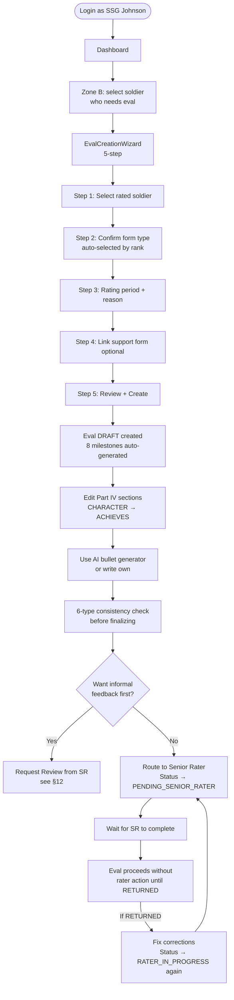
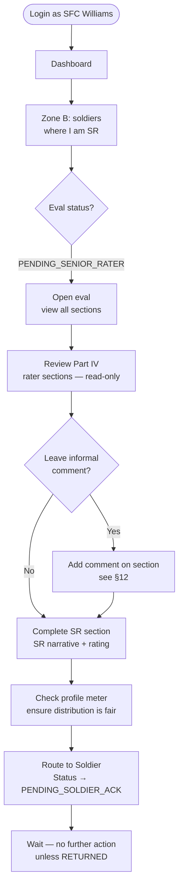
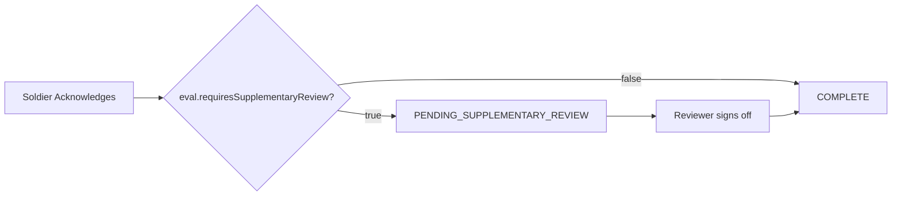
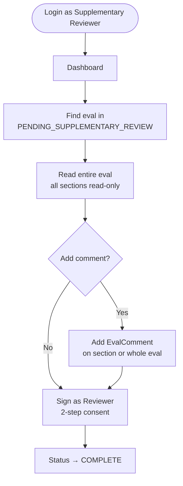
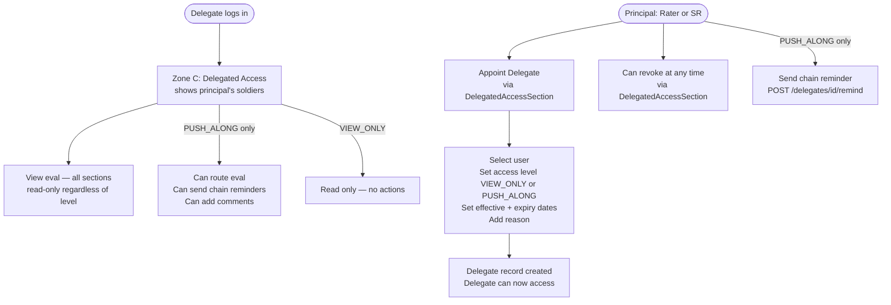
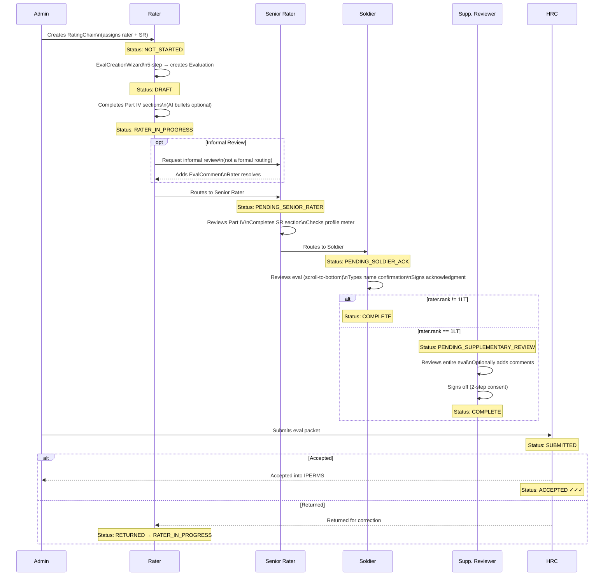
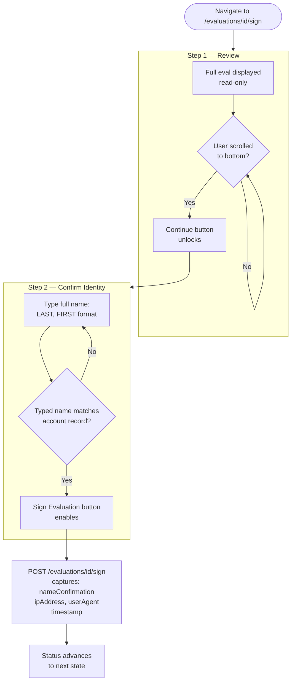
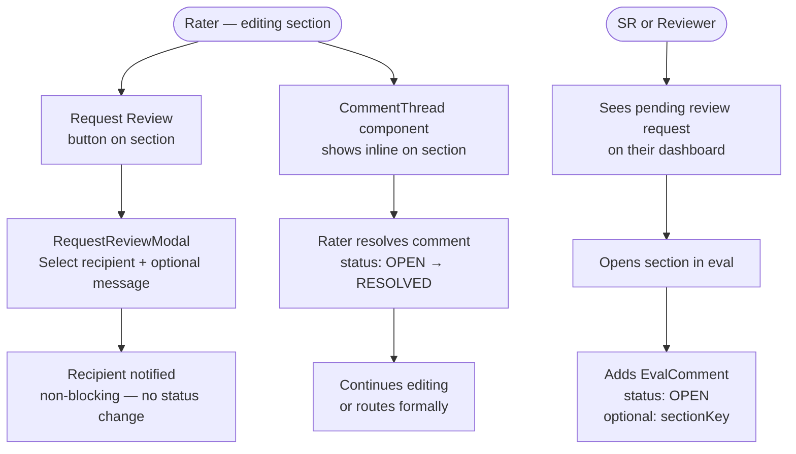
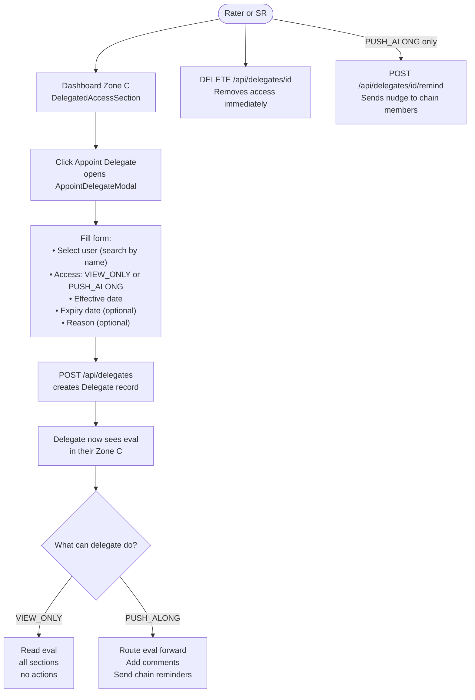

# EES 2.0 — User Flows & Role Reference

**Applies to:** All personas in dev-login + production roles  
**Source of truth:** delta.md §2, §3, §6, §7, §10, §11, §16  

---

## Table of Contents

1. [Eval Status State Machine](#1-eval-status-state-machine)
2. [Persona Overview](#2-persona-overview)
3. [Rated Soldier](#3-rated-soldier-sgt-davis)
4. [Rater](#4-rater-ssgjohnson)
5. [Senior Rater](#5-senior-rater-sfc-williams)
6. [Supplementary Reviewer](#6-supplementary-reviewer-1lt-torres-trigger)
7. [Commander](#7-commander-cpt-smith)
8. [Delegate](#8-delegate)
9. [Admin](#9-admin)
10. [Eval Lifecycle End-to-End](#10-eval-lifecycle-end-to-end)
11. [Signing Consent Flow](#11-signing-consent-flow)
12. [Collaboration & Informal Review Flow](#12-collaboration--informal-review-flow)
13. [Delegate Appointment Flow](#13-delegate-appointment-flow)
14. [Milestone & Suspense Logic](#14-milestone--suspense-logic)

---

## 1. Eval Status State Machine

Every evaluation lives in exactly **one** status. `NOT_STARTED` is computed (no DB row). `OVERDUE` is a milestone overlay — not a status.

```mermaid
stateDiagram-v2
    direction LR

    [*] --> NOT_STARTED : RatingChain active\nno Evaluation row

    NOT_STARTED --> DRAFT : Rater (or soldier) creates eval\nvia EvalCreationWizard

    DRAFT --> RATER_IN_PROGRESS : Rater completes ≥1 section

    RATER_IN_PROGRESS --> PENDING_SENIOR_RATER : Rater marks all sections done\n+ submits to SR

    PENDING_SENIOR_RATER --> PENDING_SOLDIER_ACK : SR completes SR section\n+ routes to soldier

    PENDING_SOLDIER_ACK --> PENDING_SUPPLEMENTARY_REVIEW : Soldier acknowledges\nAND rater.rank == 1LT
    PENDING_SOLDIER_ACK --> COMPLETE : Soldier acknowledges\nAND rater.rank != 1LT

    PENDING_SUPPLEMENTARY_REVIEW --> COMPLETE : Supplementary reviewer\nsigns off

    COMPLETE --> SUBMITTED : Unit admin submits\nto HRC

    SUBMITTED --> ACCEPTED : HRC accepts\ninto official record
    SUBMITTED --> RETURNED : HRC returns\nfor correction

    RETURNED --> RATER_IN_PROGRESS : Rater corrects\nand re-submits

    ACCEPTED --> [*] : Terminal — read-only forever
```



### Status Color Tokens

| Status | Token | Visual |
|---|---|---|
| `NOT_STARTED` | `--status-not-started` | ○ gray |
| `DRAFT` | `--status-draft` | ✏ slate |
| `RATER_IN_PROGRESS` | `--status-progress` | ▶ navy |
| `PENDING_SENIOR_RATER` | `--status-pending` | ⏳ amber |
| `PENDING_SOLDIER_ACK` | `--status-pending` | ✉ amber |
| `PENDING_SUPPLEMENTARY_REVIEW` | `--status-pending` | 👁 amber |
| `COMPLETE` | `--status-complete` | ✓ OD green |
| `SUBMITTED` | `--status-submitted` | ✓✓ deep green |
| `ACCEPTED` | `--status-accepted` | ✓✓✓ darkest green |
| `RETURNED` | `--status-overdue` | ✗ maroon |

---

## 2. Persona Overview

| Dev Persona | Rank | Role | Form | Builder | Rates Soldiers? |
|---|---|---|---|---|---|
| **SGT Davis** | E5 | Rated soldier only | DA 2166-9-1 NCOER | ✅ Full | ❌ |
| **SSG Johnson** | E6 | Rater of SGTs in squad | DA 2166-9-2 NCOER | ✅ Full | ✅ (as Rater) |
| **SFC Williams** | E7 | Senior Rater for junior NCOs | DA 2166-9-2 NCOER | ✅ Full | ✅ (as SR) |
| **CPT Smith** | O3 | Commander — rated + rates | DA 67-10-2 OER | 🔲 Stub | ✅ (as Rater/SR) |
| **1LT Torres** | O2 | Rater — triggers supp. review | DA 67-10-1 OER | 🔲 Stub | ✅ (triggers §review) |

---

## 3. Rated Soldier (SGT Davis)

The soldier's primary concern is their **own** evaluation. They cannot edit rater or SR sections — only acknowledge.

### What They See

```
Dashboard
├── Zone A — My Evaluation  [ALWAYS VISIBLE]
│   ├── My eval card (status, period, CTA)
│   └── My Rating Scheme (rater / SR / reviewer — read-only)
└── Zone B — [HIDDEN — rates nobody]
```

### CTA by Status

| Status | Primary CTA | Secondary CTA |
|---|---|---|
| `NOT_STARTED` | "Initiate My Evaluation" | "Start Support Form" |
| `DRAFT` / `RATER_IN_PROGRESS` | "Continue My Evaluation" | "View Support Form N entries" |
| `PENDING_SOLDIER_ACK` | **"Review & Sign Evaluation"** | "View Support Form" |
| `COMPLETE` / `SUBMITTED` / `ACCEPTED` | "View Evaluation" | "View Support Form" |

### Flow

```mermaid
flowchart TD
    Login([Login as SGT Davis]) --> Dashboard[Dashboard\nZone A only]
    Dashboard --> SupportForm[Add support form entries\nlog accomplishments daily]
    SupportForm --> Waiting{Eval status?}
    Waiting -- NOT_STARTED/IN_PROGRESS --> SupportForm
    Waiting -- PENDING_SOLDIER_ACK --> SignRoute[/evaluations/id/sign]
    SignRoute --> ScrollReview[Step 1: Scroll through\nfull eval — read only]
    ScrollReview --> NameConfirm[Step 2: Type LAST, FIRST\nto confirm identity]
    NameConfirm --> Sign[Sign Evaluation]
    Sign --> Complete[Status → COMPLETE\nor PENDING_SUPP_REVIEW]
    Complete --> ViewOnly[View finalized eval\nread-only forever]
```

### Access Rules

- ✅ Can view their own eval (all sections, read-only after routing)
- ✅ Can add/edit support form entries at any time
- ✅ Can sign acknowledgment on `PENDING_SOLDIER_ACK`
- ❌ Cannot edit rater sections, SR sections, or senior rater narrative
- ❌ Cannot see other soldiers' evaluations

---

## 4. Rater (SSG Johnson)

The rater **owns Part IV** (CHARACTER, PRESENCE, INTELLECT, LEADS, DEVELOPS, ACHIEVES) and the rater narrative. They initiate the eval and drive it to the SR.

### What They See

```
Dashboard
├── Zone A — My Evaluation  [always visible]
└── Zone B — My Soldiers  [soldiers they rate]
    ├── SoldierCard: SGT Davis
    ├── SoldierCard: SPC Reyes
    └── ...sorted by nearest due date (overdue first)
```

### Flow



### Access Rules

- ✅ Edit Part IV sections on evals they own as rater
- ✅ Create evaluations for soldiers they rate
- ✅ Request informal review before formal routing
- ✅ Appoint delegates for their soldiers' evals
- ❌ Cannot edit SR section or SR narrative
- ❌ Cannot sign as soldier or SR
- ❌ Cannot access evals in `PENDING_SOLDIER_ACK` or later stages

---

## 5. Senior Rater (SFC Williams)

The SR completes the **SR section**, sets the **profile rating**, and routes to the soldier for acknowledgment.

### What They See

```
Dashboard
├── Zone A — My Evaluation
└── Zone B — My Soldiers
    ├── SoldierCard: SSG Johnson  [SR can see: profile meter]
    ├── SoldierCard: SGT Davis    [if SR on this chain]
    └── ...
```

> **Profile Meter** is visible only to the SR. Shows how many soldiers they have rated at each category level across their entire SR history — prevents grade inflation by making the distribution visible.

### Flow



### Access Rules

- ✅ View all sections on evals where they are SR (read-only until routed to them)
- ✅ Edit SR section when status is `PENDING_SENIOR_RATER`
- ✅ Add informal comments on any section
- ✅ View profile meter (their own SR history distribution)
- ❌ Cannot edit rater sections
- ❌ Cannot initiate evals (rater does this)
- ❌ Cannot sign as soldier

---

## 6. Supplementary Reviewer (1LT Torres trigger)

The supplementary review step **only activates when the rater's rank is 1LT** (`requiresSupplementaryReview = true`). This is AR 623-3 policy — a 1LT rater requires an additional reviewing officer before the eval is finalized.

### When It Triggers



### What the Reviewer Sees

```
Dashboard
├── Zone A — My Evaluation
└── Zone B — Evals flagged for my supplementary review
    └── Shows eval in PENDING_SUPPLEMENTARY_REVIEW
```

### Flow



### Access Rules

- ✅ View all sections on flagged evals
- ✅ Add comments (advisory only — not binding like rater/SR)
- ✅ Sign off to advance to COMPLETE
- ❌ Cannot edit any sections
- ❌ Cannot decline (only sign or comment — no hard block)

---

## 7. Commander (CPT Smith)

The commander has a **formation-level view** of all subordinate soldiers and their eval status — not just their own chain.

### What They See

```
Dashboard
├── Zone A — My Evaluation  [OER stub — builder coming soon]
├── Zone B — My Soldiers  [soldiers on CPT's rating chains]
└── Sidebar Nav
    ├── /analytics   — Processing delay metrics, counseling compliance
    └── /commander   — Full formation overview
```

### Commander Page (`/commander`)

```
FORMATION OVERVIEW — B Co, 2-504 PIR

Search: [ _________________ ]

Soldier            Rank  Status              Overdue  Rater         SR
─────────────────────────────────────────────────────────────────────────
🔴 Davis, John     SGT   RATER_IN_PROGRESS   2 milestones  SSG Johnson  SFC Williams
   Johnson, Mark   SSG   PENDING_SENIOR_RATER  —         SFC Williams   CPT Smith
   Williams, Roy   SFC   DRAFT               —         CPT Smith      MAJ Thompson
   Torres, Amy     1LT   NOT_STARTED         —         CPT Smith      MAJ Thompson
```

Sort order: overdue milestones first → then alphabetical.

### Analytics Page (`/analytics`)

Shows unit-level aggregates only — never surfaces individual rater ratings.

| Metric | Description |
|---|---|
| Total active evals | Count by status |
| Overdue milestones | How many milestones past due |
| At-risk evals | Due in ≤7 days |
| Counseling compliance % | Initial + quarterly |
| Avg days per stage | Rater / SR / Soldier-Ack stages |

### Access Rules

- ✅ View full formation eval status
- ✅ Access analytics dashboard
- ✅ Appoint delegates for their soldiers
- ✅ Send chain reminders (via delegates with PUSH_ALONG access)
- ❌ Cannot edit evals they are not the direct rater/SR on
- ❌ Analytics do not reveal how any individual rated another individual

---

## 8. Delegate

A delegate is appointed by a **principal** (rater or SR) to view or help push along an evaluation on their behalf. Delegates do not sign — they are an access extension.

### Access Levels

| Level | Can View | Can Add Comments | Can Route/Push | Can Sign |
|---|---|---|---|---|
| `VIEW_ONLY` | ✅ | ❌ | ❌ | ❌ |
| `PUSH_ALONG` | ✅ | ✅ | ✅ | ❌ |

### What a Delegate Sees

```
Dashboard
├── Zone A — My own evaluation
├── Zone B — My own soldiers (if any)
└── Zone C — Delegated Access  [NEW — only renders if records exist]
    └── DelegatedAccessSection
        ├── "I have delegated" — soldiers I've shared with others
        └── "Delegated to me" — evals I can access on behalf of someone
```

### Flow



### Expiry

Delegate records have an optional `expiryDate`. After expiry, access is automatically blocked. Principal can extend or revoke at any time.

---

## 9. Admin

Admin users manage the roster, rating chains, and unit structure. They also submit completed evaluations to HRC.

### Sidebar Nav (Admin)

```
/admin/users          — Create, edit, deactivate soldiers
/admin/units          — Unit hierarchy management
/admin/rating-chains  — Assign rater/SR/reviewer to soldiers
```

### Key Actions

- Create user accounts (manual entry — IPPS-A stub in production)
- Build rating chains: assign `ratedSoldierId`, `raterId`, `seniorRaterId`, optional `reviewerId`
- Deactivate chains when soldiers PCS or ETS
- Submit `COMPLETE` evals to HRC (status → `SUBMITTED`)

---

## 10. Eval Lifecycle End-to-End

Full sequence from creation to official record, showing all actors:



---

## 11. Signing Consent Flow

Two-step mechanism — no single-click signing. Both conditions must be met.



Captured in `Signature` record: `nameConfirmation`, `ipAddress`, `userAgent`, `cacCertSerial` (future PKI).

---

## 12. Collaboration & Informal Review Flow

Before formal routing, raters and SRs can exchange feedback **inside the system** — no emailing Word documents.



### Comment Rules

- Comments are **advisory only** — they do not block routing
- Only the rater or SR of the eval can view comments (not the soldier)
- `parentId` enables threaded replies
- Rater can delete their own unresolved comments
- Once `RESOLVED`, comments are locked (audit trail)

---

## 13. Delegate Appointment Flow



---

## 14. Milestone & Suspense Logic

8 milestones are auto-generated on eval creation. `OVERDUE` is a **display flag** overlaid on whatever status the eval is in — it is not a status itself.

### The 8 Milestones (in order)

| # | Milestone Type | Typical Deadline |
|---|---|---|
| 1 | `INITIAL_COUNSELING_DUE` | 30 days after rating period start |
| 2 | `QUARTERLY_COUNSELING_1` | ~90 days in |
| 3 | `QUARTERLY_COUNSELING_2` | ~180 days in |
| 4 | `QUARTERLY_COUNSELING_3` | ~270 days in |
| 5 | `RATER_DRAFT_DUE` | 60 days before period end |
| 6 | `SR_DRAFT_DUE` | 45 days before period end |
| 7 | `SOLDIER_ACK_DUE` | 30 days before period end |
| 8 | `EVAL_SUBMISSION_DUE` | Period end date |

### Milestone Status Values

```
UPCOMING   → due in >7 days   (blue dot)
DUE_SOON   → due in ≤7 days   (amber dot)
OVERDUE    → past due date    (red dot)
COMPLETE   → marked done      (green check)
WAIVED     → waived with reason (gray W)
```

### Who Sees Milestones

| View | Where |
|---|---|
| Rater / SR | SuspenseTimeline on soldier card (horizontal dot strip) |
| Commander | FormationSuspenseView (grid: soldiers × milestones) |
| Analytics | Overdue count + counseling compliance % |

### Waiving a Milestone

```
PATCH /api/milestones/id
{ action: "waive", reason: "...", waivedBy: userId }
```

Only the rater, SR, or an admin can waive. Waived milestones are logged and visible to commanders.

---

*Last updated: 2026-06-28 | Source: delta.md*
